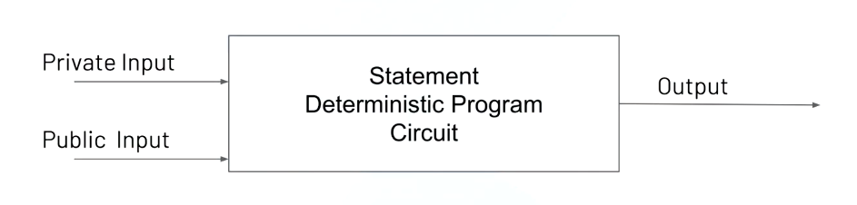

# How to use circom and snarkjs

Hello and welcome!

In this guide we'll guide you through the creation of your first [zero-knowledge snark](basics/key-concepts#zk-snarks) circuit using [circom](https://github.com/iden3/circom) and [snarkjs](https://github.com/iden3/snarkjs).

[Circom](https://github.com/iden3/circom) is a library that allows you to build circuits to be used in zero knowledge proofs. 

While [snarkjs](https://github.com/iden3/snarkjs) is an independent implementation of the zk-snarks protocol -- fully written in JavaScript.

Circom is designed to work with snarkjs. In other words, any circuit you build in circom can be used in snarkjs.

We'll start by covering the various techniques to write circuits, then move on to creating and verifying a proof off-chain, and finish off by doing the same thing on-chain on Ethereum.

If you have zero knowledge about zero-knowledge 😋 or are unsure about what a zk-snark is, we recommend you read [this page](basics/key-concepts#zero-knowledge-proofs) first.


## 1. Installing the tools

### 1.1 Prerequisites

First off, we need to be sure we have a recent version of `Node.js` installed.

While any version after `8.12.0` should work fine, we recommend you install version `10.12.0` or later.

Why? These later versions of Node include big integer libraries natively. `snarkjs` makes use of this feature (if available) to improve performance by up to **10x**.

To see which version of Node you have installed, from the command line run:

```
node -v
```

To download the latest version of Node, [click here](https://nodejs.org/en/download/).

### 1.2 Installing **circom** and **snarkjs**

As stated in the introduction, circom and snarkjs are the libraries we use to create zero-knowledge proofs.

If you haven't done so already, you can install them from NPM by running the following commands:
```
   npm install -global circom
   npm install -global snarkjs
```

Hopefully both libraries installed successfully.

If you're on a Unix machine and you're seeing some errors (e.g. `node-gyp rebuild`) it's probably because you need to update your version of Node to the latest long term support (LTS) version, at the time of writing this is `v10.15.3`.

If you're seeing one or more errors that look like:

`EACCES: permission denied`

It's probably because you originally installed Node with root permissions. Because of this, writing to your npm directory (`npm install -global`) requires root permissions too.

While it's not a good idea to have Node  installed this way, one way to quickly give yourself root permissions is to run the slightly modified commands:

```
sudo npm install -global --unsafe-perm circom
sudo npm install -global --unsafe-perm snarkjs
```

An arguably better way to fix this is to follow the steps outlined in this [stackoverflow answer.](https://stackoverflow.com/a/24404451)

## 2. Building a circuit with circom

### 2.1 Definition
First off, let's define what we mean by a circuit.

For our purposes, a circuit is equivalent to a **statement** or **deterministic program** which has an output and one or more inputs. 



There are two types of possible inputs to a circuit: `private` and `public`. The difference being that a `private` input is hidden from the verifier.

### 2.2 Motivation

The idea here is that given a `circom` circuit and its inputs, the prover can run the circuit and generate a proof -- using `snarkjs` -- that she ran it correctly.

With the proof, the output, and the public input(s), the prover can then prove to the verifier that she knows one or more private inputs that satisfy the constraints of the circuit, **without revealing anything about the private input(s)**.

In other words, even though the verifier has **zero knowledge about the private inputs** to the circuit, the proof, the output, and the public inputs(s) are enough to convince her that the prover's statement is valid (hence the term zero-knowledge proof).

### 2.3 Toy example

Don't worry if some (or all) of the above sounded a little abstract. In this section we'll go through an example that should help clarify things.

Let’s create a circuit that tries to prove to someone (the verifier) that we are able to factor an integer `c`.

It turns out that factoring an integer can be quite difficult -- in particular, the prime factorization of very large numbers can be [very difficult](https://www.reddit.com/r/math/comments/2jo786/why_is_the_prime_factorization_of_very_large/cldj3a9/).

For very large numbers, no efficient, non-quantum integer factorization algorithm is known.

>Note: While common consensus is that no efficient algorithm exists, it has not been proven to be the case. To prove such a thing would be equivalent to proving that [P = NP](https://en.wikipedia.org/wiki/P_versus_NP_problem) -- in other words it would require solving one of the major unsolved problems in computer science. For more on how NP and complexity-theoritic reductions relate to zk-snarks see this excellent [post by Chrisitian Reitwiessner](https://blog.ethereum.org/2016/12/05/zksnarks-in-a-nutshell/#p=np).

The presumed difficulty of this problem is at the heart of widely used algorithms in cryptography such as [RSA](https://en.wikipedia.org/wiki/RSA_(cryptosystem)).

If this problem were easy to solve, cryptography as we know it would break down. Which means there's a big chance that cryptocurrencies would cease to exist from one day to the next!

In this toy example we'll neither work with very large numbers, nor restrict their factors to primes. Nevertheless the general principle remains the same.

We want to prove that we know two numbers (call them `a` and `b`) that multiply together to give `c`. Without revealing `a` and `b`.

1. The first step is to create (and move into) a new directory called ``factor`` where we'll put all the files that we want to use in this guide.

```
mkdir factor
cd factor
```

   >Note: if we were designing a circuit for actual use, we'd probably be better off creating a ``git`` repository with a ``circuits`` directory containing the necessary scripts to build all our circuits, and a ``test`` directory with all our tests.

2. Next, we want to create a new file (in `factor`) named `circuit.circom`. The contents should look like this:

```
   template Multiplier() {
       signal private input a;
       signal private input b;
       signal output c;
       
       c <== a*b;
   }

   component main = Multiplier();
   ```
   
   As you can see, this circuit has **two private input** signals named ``a`` and `b` and **one output** signal named `c`.
   
   The inputs and the outputs are related to each other using the `<==` operator. In circom, the `<==` operator does two things. The first is to connect signals. The second is to apply a constaint.
   
   In our case, we're using `<==` to connect `c` to `a` and `b` and at the same time constrain `c` to be the value of `a*b`. 
   
   >Note: after declaring the ``Multiplier`` template, we instantiate it with a component named ``main``. When compiling a circuit, a component named ``main`` must always exist.
   
3. We are now ready to compile the circuit -- we need to do this to be able to use it in `snarkjs` later. To compile the circuit to a file named `circuit.json`, run the following command:
```
circom circuit.circom -o circuit.json
```

If you've made it this far, congratulations! 🎉🎉

You've just built and compiled your first circuit using `circom`.

## 3. Taking the compiled circuit to *snarkjs*

Now that the circuit is compiled, we can use it in `snarkjs` to create a proof.


### 3.1 Viewing information about the circuit

Before we start, let's have a look at some of the information `circuit.json` gives us.

From the command line run:

```
snarkjs info -c circuit.json

```

You should see the following output:

```
# Wires: 4
# Constraints: 1
# Private Inputs: 2
# Public Inputs: 0
# Outputs: 1
```
This information seems to fit the multiplication circuit we defined in section 2. Remember, we had two private inputs `a` and `b`, and one output `c`. And the one constraint we specified was that `a` * `b` = `c`.

To see the constraints of the circuit, we can run:

```
snarkjs printconstraints -c circuit.json
```

You should see the following output:

```
[  -1main.a ] * [  1main.b ] - [  -1main.c ] = 0
```

Don't worry if this looks a little strange. You can ignore the `1main` prefix and just read this as:

`(-a) * b - (-c) = 0`

Which is the same as `a * b = c`. Reassuringly, this is the same constraint we defined in `circuit.circom`.

>Note: to see a list of  all `snarkjs` commands, as well as descriptions about their inputs and outputs, run `snarkjs --help` from the command line.


### 3.2 Setting up using *snarkjs*

The first step in generating a zero-knowledge proof requires what we call a **trusted setup**.

While explaining exactly what a trusted setup is is beyond the scope of this guide, let's try and develop some intuition for why we need it.

The need for a trusted setup essentially boils down to the fact that **the balance between privacy for the prover and assurance of not cheating for the verifier is delicate.**

To maintain this delicate balance, zero-knowledge protocols require the use of some randomness.

Usually, this randomness is encoded in the challenge the verifier sends to the prover, and serves to prevent the prover from cheating.

The randomness however can't be public, because it's essentially a backdoor to generating fake proofs.

This implies that a trusted entity should generate the randomness. Hence the term **trusted setup**.

Ok, now that we have a better intuition for what we are doing, let’s go ahead and create a trusted setup for our circuit.

From the command line, run:

```
snarkjs setup
```

   >Note: By default `snarkjs` will look for and use `circuit.json`. You
   can specify a different circuit file by adding
   `-c <circuit JSON file name>`

This will generate both a proving and a verification key in the form of 2 files:
`proving_key.json` and `verification_key.json`

We'll need these later on to create and verify the proof.

### 3.3. Calculating a witness

Before creating the proof, we need to calculate all the intermediate signals of the circuit. In other words, we need to calculate the signals that match the constraints of the circuit.

`snarkjs`'s `calculatewitness` command calculates these for us.

`calculatewitness` takes as input a file with the inputs to the circuit. It executes the circuit with these inputs, keeping track of all the intermediate signals along the way.

This set of signals -- the input, the intermediate signals, and the output -- is called the *witness*.

Why do we need a witness?

Remember, in a zk proof, the prover needs to prove to the verifier that she knows a set of signals that match all the constraints of the circuit, without revealing any of the signals except the public input(s) and the output. **The witness contains this set of signals.**

>Note: the witness is kept secret from the verifier. It's used by the prover to generate the proof that she knows the set of signals contained in the witness.

In our case, we don't have any intermediate signals because we just have one constraint -- `a * b = c` -- so the witness is just the inputs -- `a` and `b` -- and the output -- `c`.

For example, imagine that we want to prove that we are able to factor 33. That means that we need to prove that we know two numbers `a` and `b` that multiply to give 33.

Since the only two (distinct) numbers that multiply to give 33 are 3 and 11, let’s create a file named `input.json`, with the following content:

```
{"a": 3, "b": 11}
```

Now run the following command to calculate the witness:

```
snarkjs calculatewitness --circuit circuit.json --input input.json
```

You should see that a `witness.json` file has been created with all of the relevant signals.

If you open it up, it should look something like this:

```
[
 "1",
 "33",
 "3",
 "11"
]
```
Where `33` is the output, and `3` and `11` are the inputs we defined in `input.json`.

>Note: In addition to the output, inputs, intermediate signals, you should see that the witness contains a dummy variable `1` at the beginning. To understand why this `1` is needed requires diving too deep into the details of zk proofs and as such is beyond the scope of this post. If you're curious as to why, see [this post by Vitalik](https://medium.com/@VitalikButerin/quadratic-arithmetic-programs-from-zero-to-hero-f6d558cea649).

>Note: You might have noticed that there's nothing about the circuit that prevents us from setting `a = 1` and `b = 33`. We will deal with this problem later.

### 3.4 Creating the proof

Now that we have the witness and the proving key, we're ready to create the proof.

To create the proof, run:

```
snarkjs proof --witness witness.json --provingkey proving_key.json
```

This will generate the files `proof.json` and `public.json`.

`proof.json` contains the actual proof. Whereas
`public.json` contains just the values of the public inputs and outputs.

### 3.5 Verifying the proof

In practice at this stage you would hand over both the `proof.json` and `public.json` files to the verifier.

In this toy example, however, we're going to play the role of the verifier too.

Remember, with the proof, and the public input and outputs, the prover can now prove to the verifier that she knows one or more private signals that satisfy the constraints of the circuit, without revealing anything about those private signals.

From the verifier's point of view, the verifier can verify that the prover knows the set of private signals contained in the witness -- without having access to the witness.

With the proof at hand (`proof.json`), this amounts to checking that the prover knows a witness with public inputs and outputs that match the ones in `public.json`.

To verify the proof run:

```
snarkjs verify --verificationkey verification_key.json --proof proof.json --public public.json
```

You should see `OK` as the output. This signifies the proof is valid.

For invalid proofs, you'll see `INVALID` instead.

To check this create a new file called `public-invalid.json` with `34` as the public output instead of `33`.

It should something look like:

```
[
 "34"
]
```

Now run:

```
snarkjs verify --verificationkey verification_key.json --proof proof.json --public public-invalid.json
```

You should see that the output of this command is now `INVALID`.

### 3.6 Bonus

At the end of section 3.4 we noted that there's nothing about the circuit we created that prevents us from using `a = 1` and `b = c` (or vice-versa) to satisify the constraints of the circuit, for any `c`.

We can fix this by adding some extra constraints.

The trick is to use the property that **0 has no inverse**. This means that if we want to prevent `a` or `b` from being set to `1` we can just add a couple of constraints that prevent `a-1` and `b-1` from having an inverse.

>Note: the inverse of `a-1` is `1/(a-1)`

With the above insight, we can modify the circuit as follows:

```
   template Multiplier() {
       signal private input a;
       signal private input b;
       signal output c;
       signal inva;
       signal invb;
       
       inva <-- 1/(a-1);
       (a-1)*inva === 1;
       
       invb <-- 1/(b-1);
       (b-1)*invb === 1;    
       
       c <== a*b;
   }

   component main = Multiplier();
```

You should notice that we have two new operators here, `<--` and `===`.

`<--` assigns a value to a signal without adding a constraint.

Whereas `===` adds a constraint without assigning a value to
a signal.

>Note: `<==` is just the combination of `===` and `<--`. In other words `<==` assigns a value and adds a constraint in one go. But since this isn't always desirable, the flexibility of circom allows us to split this up into two steps.

>Note: It turns out there's still a subtle problem with our circuit. Since the operations take place over a [finite field](https://en.wikipedia.org/wiki/Finite_field), we need to guarantee that the multiplication doesn't overflow. This can be done by binarizing the inputs and checking the ranges. If that didn't make any sense to you, don't worry, we'll coverthis in a future tutorial.

## 4 Proving on-chain

### 4.1 Generating a solidity version of the proof

We can use `snarkjs generateverifier` to generate a solidity smart contract that verifies the zero knowledge proof.

From the command line run:

```
snarkjs generateverifier --verificationkey verification_key.json --verifier verifier.sol
```

As you can see, `generateverifier` takes a verification key as input -- in our case `verification_key.json` -- and generates a solidity version of the verifier in a file we specify -- in our case `verifier.sol`.

### 4.2 Publishing the proof

To publish the proof, we can upload `verifier.sol` directly into [Remix](https://remix.ethereum.org).

For those of you who are unfamiliar, Remix is an open source tool that helps you write (and publish) Solidity contracts straight from the browser. If this is your first time using it, we recommend you have a look at [this tutorial](https://kauri.io/article/124b7db1d0cf4f47b414f8b13c9d66e2/remix-ide-your-first-smart-contract) before continuing.

If you take a look inside `verifier.sol` you should see that it contains two contracts: Pairings and Verifier. For our purposes, we just need to deploy the `Verifier` contract.

>Note: You may want to use a test net like Rinkeby, Kovan or Ropsten to avoid spending real money. You can also use the Javascript VM, but in some browsers, the verification takes a long time and it may hang the page.

### 4.3 Verifying the proof

The verifier contract deployed in the last step has a function
called `verifyProof`.

It takes as input nine parameters and returns `true` if the proof and the inputs are valid.

To make things easy, you can use snarkjs to output the nine parameters into the console
by running:

`snarkjs generatecall --proof proof.json --public public.json`

Now, just cut and paste the output of this command into the parameters field of the
`verifyProof` method in Remix and run it.

If everything works as expected, it should return `true`.

If you change one of the parameters and run it again, you should see that the result is now `false`.


## 5. Where to go from here

If you've enjoyed this guide and want to deepen your understanding of our tools, we recommend you checkout the [circom repository](https://github.com/iden3/circom).

You may also be interested in taking a look at [circomlib](https://github.com/iden3/circomlib): a library containing useful and reusable circuits implemented in [circom](https://github.com/iden3/circom).

>Note: circomlib contains some useful basic circuits, as well as implementations of the [Pederson Hash](https://github.com/iden3/iden3-docs/blob/master/source/iden3_repos/research/publications/zkproof-standards-workshop-2/pedersen-hash/pedersen.rst) and Exponentiation circuits using the [Baby-Jubjub](https://github.com/iden3/iden3-docs/blob/master/source/iden3_repos/research/publications/zkproof-standards-workshop-2/baby-jubjub/baby-jubjub.rst) elliptic Curve.


## 6. Final note

From a developer's point of view, there are few things worse than working with a buggy compiler.

The compiler is still in its early stages, and work still needs to be done, so you may come across bugs.

Please keep this in mind if you are using circom to do anything serious.

>Note: If you come across what you believe to be a bug, please don't hesitate to let us know: a [github issue](https://github.com/iden3/circom/issues) with a small piece of code highlighting the problem is perfect.

In the meantime, enjoy zero knowledge proving! 💛
