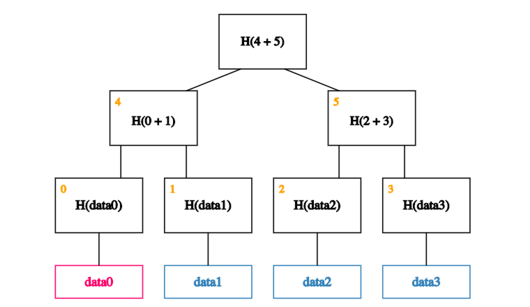
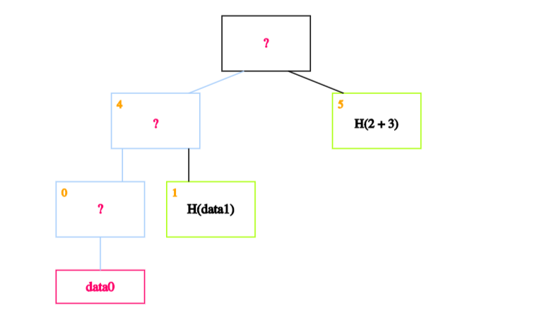
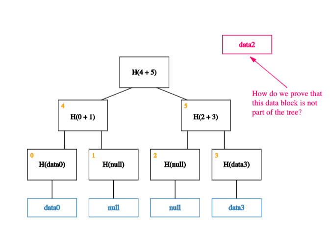

# Key Concepts

## Identity

At Iden3, our goal is to democratize identity. We believe that everyone should be empowered to become their own [certification authority](https://en.wikipedia.org/wiki/Certificate_authority).

**What Do We Mean by Identity?**

An identity can be a person, a company, an organization, a [DAO](https://hackernoon.com/what-is-a-dao-c7e84aa1bd69), or a government. Identity can even be a thing: a chair, a room, a bot, and so on. When we talk about identities, we are referring to "identities as accounts".

Generally speaking, these accounts are going to be smart contracts. So **you can think of identities as smart contracts**, where the address of the contract is the identifier of that identity.

**Key Takeaways**:

- **Anything** can be an identity.

- One person can define and have many identities.

- In Ethereum, an identity is an **account** or a smart contract.

## Claims

An [identity](#identity)  can provide a claim. You can think of a claim as a statement: something an identity is saying.

Most of the time, these statements refer to other identities. In other words, **claims usually create relations between identities.**

For example, when a university (identity) says that a student (identity) has a degree, this is a statement (claim) about the student. This statement creates a relation between the student and the university.

**Claims can be public or private.** And it turns out that almost anything we say or do can be thought of as a claim. Company invoices, Facebook likes, and email messages can all be thought of as claims.

### Examples of Claims

- A certificate (e.g. birth certificate)

- A debt recognition

- An invoice

- An Instagram "Like"

- An endorsement (reputation)

- An email

- A driving license

- A role in a company

- ... Almost anything!

## Zero-knowledge Proofs

*In cryptography, a zero-knowledge proof or zero-knowledge protocol is a method by which one party (the prover) can prove to another party (the verifier) that they know a value x, without conveying any information apart from the fact that they know the value x.* ([Source](https://en.wikipedia.org/wiki/Zero-knowledge_proof))

In other words, zero-knowledge proofs allow us to prove something specific without revealing any extra information.

Why do we care? Simply put, when we're talking about claims, sometimes, we want to prove things in a private manner.

### Examples

#### Nightclub Entry

Say you want to enter a nightclub, and you need to prove to the bouncer that you are over 18. But you don't want to reveal to him your name, address, or anything else that's not relevant.

With zero-knowledge proof, you can prove that you hold the key that belongs to an identity that the state says is over 18, without revealing anything else about that identity.

#### ICO Participation

Say an ICO is available only to KYC-approved or authorized users. With ZK proofs, you can prove that you are an authorized person to participate in the ICO without revealing who you are or how much you spent.

#### Anonymous Voting

Similar to the above, ZK proofs allow you to prove that you are an eligible identity, without revealing your identity.

### Non-reusable Proofs

A non-reusable proof is a received proof that is not valid to be sent to a third identity.

For example, imagine that you belong to a given political party. This party has made a private claim that you belong to it.

Now, you want to prove to another identity that you belong to the party, but you don't want that this identity to pass on that proof to others. In other words, you want to make sure the proof stays between the two of you.We can do this using zero-knowledge proofs.

How?

To prove something - let's call it A - we can create a new proof called B that is valid either if A is valid or we know the private key of the recipient, R.

<!-- TODO *image coming soon* -->

Clearly, we don't know R's private key, so when we share a valid proof B with R, R knows that A must be valid.

<!-- TODO *image coming soon* -->

To see why B is non-reusable, let us suppose that R wants to share B with another recipient R'.

<!-- TODO *image coming soon* -->

Now, from the perspective of R', B is valid either if A is valid or R knows its own private key.

<!-- TODO *image coming soon* -->

But since R clearly knows its private key, R' can't tell whether A is valid or not.

<!-- TODO *image coming soon* -->

### ZK-SNARKs

You can think of ZK-SNARKs as an efficient way to produce zero-knowledge proofs. These are the proofs that are short enough to be published on blockchain and that can be read later by a verifier.

## Digital Signatures

A digital signature is a mathematical scheme for demonstrating the authenticity of digital messages or documents. A valid digital signature gives a recipient reason to believe that the message was created by a known sender, that the sender cannot deny having sent the message (authentication and non-repudiation), and that the message was not altered in transit (integrity). ([Source](https://en.wikipedia.org/wiki/Digital_signature))

We use digital signatures for user authentication purposes and to prove that a claim was issued by a specific identity.

## Merkle Trees

In cryptography and computer science, a Merkle tree is a tree in which every leaf node is labeled with the hash of a data block and every non-leaf node is labeled with the cryptographic hash of the labels of its child nodes. ([Source](https://en.wikipedia.org/wiki/Merkle_tree))

We care about Merkle trees because we want to build a data structure that:

- Can store lots of data (**scalability**)
- Makes it easy to prove that some data exists (**proof of membership**)
- Allows us to check that the data hasn't been altered (**tamper resistance**)

Merkle trees satisfy the three properties mentioned above.

### Specifications

Before we take a closer look at these properties, let's go through how to build a Merkle tree with some given data.

Suppose we have several blocks containing data and that these blocks form the leaves of our tree. The first step is to create a parent node for each data block. These parent nodes form the next level in the tree and store the hash of their descendent data block.

Next, we group these parent nodes into pairs and store the hash of each pair one level up the tree.

We continue doing this until we are left with a single block, the root of the tree, also called Merkle Root.

### Tamper Resistance

It turns out that any attempt to tamper with any piece of data can be detected by simply remembering the hash at the root of the tree.

To understand why this is the case, let’s look at what happens if an adversary wants to tamper with a data block.

If an adversary tampers with a block at the leaf of our tree,

it will cause the mismatch with the hash in the node that’s one level up.

So the adversary will have to tamper with that too.

This means s/he has to tamper with the node one level up from there.

And so on… Eventually, s/he will get to the root. If s/he tries to tamper with the root too, we’ll know because this is the node we’ve kept track of.

### Proof of Membership

Merkle trees allow us to quickly check membership (through a neat mechanism known as Merkle proofs). What do we mean by that?

Suppose that, as usual, we remember just the root (on-chain). And we want to prove that a certain data block, data0, is a member of the Merkle tree.

All we need are the blocks on the path from the data block to the root.

And each of data0's siblings on the way up.

We can ignore the rest of the tree, as these blocks are enough to allow us to verify the hashes all the way up to the root of the tree. But how?

The idea is to recalculate the root by recursively hashing the data. If the calculated root is equal to the on-chain root, it proves that the data block exists in the Merkle tree.

In our case, we start by calculating the hash of data0 and storing it in the block labeled 0.

We then calculate the hash of the hash of data0 concatenated with the hash of data1. In other words, we calculate the hash of the concatenation of blocks 0 and 1 and store it in block 4.

Finally, we calculate the hash of blocks 4 and 5 to obtain the recalculated root.

If the calculated root is equal to the on-chain root, we’ve proven that data0 exists in the Merkle tree.

In technical terms:

*This means that if there are n nodes in the tree, only about log(n) items need to be shown. And since each step just requires computing the hash of the child block, it takes about log(n) time for us to verify it. And so even if the Merkle tree contains a very large number of blocks, we can still prove membership in a relatively short time. Verification thus runs in time and space that’s logarithmic in the number of nodes in the tree.* ([Source](https://d28rh4a8wq0iu5.cloudfront.net/bitcointech/readings/princeton_bitcoin_book.pdf) (pg 35))

### Scalability

Storing data on a blockchain is expensive. Merkle trees help us in minimizing the amount of data stored on-chain. How?

As we saw in the previous sections, to ensure tamper-resistance and Proof of Membership, we need to store only the root of the tree, not the whole tree. This means that no matter how big the tree is, the only piece of data we actually need to store on-chain is the root.

### Sparse Merkle Trees
At Iden3, we use a slightly more complex data structure called a sparse Merkle tree. 

A sparse Merkle tree is like a standard Merkle tree, except that its contained data is indexed, and each data block is placed at the leaf that corresponds to that block's index.

In addition to inheriting the *tamper-resistance* and *proof of membership* properties from normal Merkle trees, sparse Merkle trees make it easy to prove that some data doesn’t exist (*proof of non-membership*).

#### Proof of Non-membership

Now consider that we only have two pieces of data -- `data0` and `data3` -- with indices `0` and `3` respectively.  To construct a sparse Merkle tree, we populate the 0th and 3rd leaves with this data, leaving the 1st and 2nd leaves empty.

Well, almost empty! To be precise, we fill the 1st and 2nd leaves in with a special placeholder value like `null`.

With this placeholder, we can now build up the rest of the tree.

Now, what happens if we want to prove that a piece of (indexed) data -- `data2` -- is not a member of this tree?

Thanks to the way our data is indexed, proving that `data2` is not a member of the tree is equivalent to proving that the value of the leaf at index `2` is `null`!

Put another way, proving non-membership of a `data` block is equivalent to proving membership of `null` (a simple Merkle proof). And as we saw in our previous post, doing this efficiently is a basic property of a Merkle tree.

#### Summary

By indexing data and making leaves empty, sparse Merkle trees allow us to reframe proofs of non-membership into proofs of membership (a.k.a Merkle proofs), making it easy to prove that some data does not exist.

One drawback to sparse Merkle trees is that they are really big. This means that without optimizations, read and write operations can be quite inefficient.

> For example, a sparse Merkle tree usually has 2^256 leaves vs. 2^32 for a normal Merkle tree. This means that naive implementations require 256 operations to read or write (vs 32).

Luckily, these sorts of inefficiencies are largely illusory. Since fairly simple [optimizations](https://ethresear.ch/t/optimizing-sparse-merkle-trees/3751) exist to get around them!

!!!note
    While we won't get into the details here, one of the keys to these optimizations is that sparse Merkle trees are mostly sparse. This means many of the subtrees will end up being zero subtrees. 
    
    Since H(0), H(H(0)), H(H(H(0))), and so on are all constant values, the zero-subtrees can be cached (calculated once, stored, and then omitted from Merkle proofs), greatly reducing the size of computations.

### Why Do We use Merkle Trees at Iden3?

At Iden3, one of our major goals is scalability. Specifically, we believe that anybody should be able to create as many identities as they want. And that **any identity should be able to generate as many claims as it wants.**

Imagine if you had to make a new transaction to the blockchain every time you wanted to make a new claim? Even worse, imagine you're a government institution and you're responsible for making millions of claims every day.

Achieving this goal requires minimizing the amount of data stored on-chain. This is where Merkle trees come into the picture.

Even if you're a government institution that is making millions of claims a day, you can just construct a tree (off-chain) with each claim as a separate data block, and simply calculate and store the root on-chain.

In other words, Merkle trees allow prolific claim generators to add/modify **millions of claims** in a single transaction. This makes it easy to scale the claims.

### Definitions

#### Hash Functions

A hash function maps an input string of any size to an output string of a fixed size.

It must be efficiently computable (for any given input string, we can figure out the output of the hash function in a reasonable amount of time. More technically, computing the hash of an n‐bit string should have a running time that is O(n)).

For a hash function to be cryptographically secure, it must have three additional properties: 

- Collision Resistance
- Hiding
- Puzzle-friendliness

While we would not get into the details here, let's briefly discuss what each of these properties stands for.

**Collision Resistance** means that nobody can find two inputs that map to the same output.

**Hiding** means that given an output there's no feasible way to figure out the input that generated it.

**Puzzle-friendliness**, intuitively, means that it is very hard to target the hash function to come out to some particular output value y. 

#### Hash Pointers

A hash pointer is simply a pointer to where some information is stored together with a cryptographic hash of the information. **A pointer gives you a way to retrieve the information, whereas a hash pointer gives you a way to verify that the information wasn't changed.**

In other words, a hash pointer is a pointer to where data is stored along with a cryptographic hash of the value of that data at some fixed point in time.

If at some point in the future, we want to check if the data hasn't changed, we simply hash the data again and verify that the new output (cryptographic hash) matches the previous output. This works because we know by the **collision resistance** property of the hash function that nobody can find two inputs that map to the same output. So if the output is the same, the input must also have been the same.

