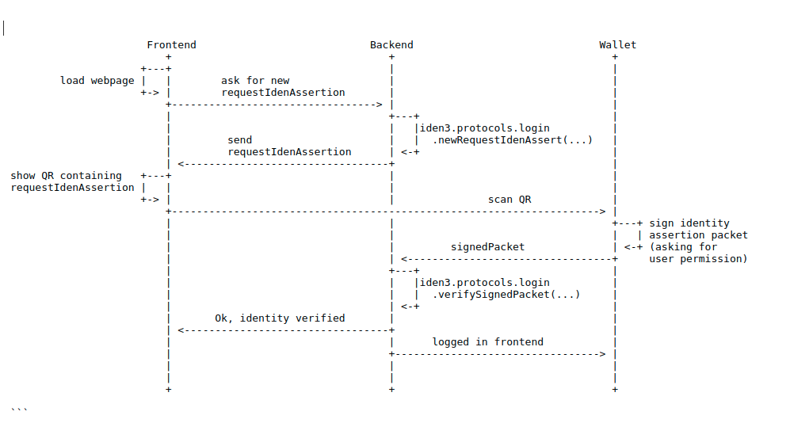

# Centralized Login Use Case

## Overview

This document will guide you through the steps required to integrate iden3's technology into your application's login.

## Introduction

Iden3 is a complete decentralized identity management solution that allows users to leverage their pre-existing validated identities. This helps these users prove that they are who they claim to be; thus saving them the hassle of registering with each service (each requiring a validated identification) individually. One of the direct applications of the iden3 technology is to allow web services to reuse these identities for logging into their portals.

The diagram below shows the steps of the backend process; follow these to enable a user gain access to your application using the iden3 identity system once the s/he has requested to log in.


Iden3 provides an SDK to take care of requesting and verifying the identity so that the users can be authenticated.

## Platforms Supported

- **JavaScript:** <https://github.com/iden3/iden3js>

- **Go:** <https://github.com/iden3/go-iden3>

## Pre-requirements

The minimum requirements for a functional centralized login include:

1.  The iden3 wallet service has been deployed.
2.  A user attempting to log in has at least one valid identity.

## Integration

A JavaScript reference implementation of how a third-party can integrate the iden3 solution to log in to its application can be found at:
<https://github.com/iden3/centralized-login-demo>. 
In this example, the external service includes a front-end and a back-end server. Let's see how this division into the front-end and the back-end actually works:

<!-- Some examples of how the Go implementation is used can be found at:
<https://github.com/iden3/go-iden3/blob/master/services/signedpacketsrv/signedpacket_test.go> -->

### Front-End

On the front-end, you need to embed a button to initiate the login process. You will also need to display a QR code that the user can scan to complete the authentication. After the button is pressed, the front-end makes a request to the back-end to start the identity authentication process and waits for the response containing the QR code to be displayed and scanned by the user.

In the reference implementation, this is achieved by the JavaScript function *getLoginData()*, found in frontend/index.js. This code shows how to:

1.   Send a request for a new *requestIdenAssert* packet to the centralized application back-end.
2.  Open a WebSocket between the front-end and back-end.
3.   Display a QR code containing the *requestIdenAssert* packet to be signed by iden3's wallet.

### Back-End

#### Generating Requests of Identity Assertion

On the back-end, you will need to prepare a new API endpoint to handle the *requestIdenAssert()* petitions from the front-end. In the reference implementation, we use *GET/login* by calling the JavaScript function:

``` {.sourceCode .javascript}
const signatureRequest = iden3.protocols.login.newRequestIdenAssert(nonceDB, origin, timeout);
```

or the Go function:

``` {.sourceCode .c}
requestIdenAssert := NewRequestIdenAssert(nonceDb, origin, timeout)
```

where:

-   **nonceDB** is a NonceDB object generated by calling an API function and stored in a RAM database.
-   **origin** is the domain of the emitter of the request, for example, *myweb.com*.
-   **timeout** is the timeout in seconds, for example, two minutes (*120s*).

The nonceDB is obtained by calling the following JavaScript function:

``` {.sourceCode .javascript}
const nonceDB = new iden3.protocols.NonceDB();
```

or the Go function:

``` {.sourceCode .c
nonceDb := core.NewNonceDb()}
```

Once you have the *signatureRequest* object, you can return it back to the front-end so that it can be displayed.

#### Verifying signedPacket

On the back-end, you will also need to prepare a new API endpoint to handle the responses from the iden3 wallet containing the *signedPacket*. In the reference implementation, we use *POST /login* to allow the walled to send the signed data.

To perform the verification in the newly added endpoint you just need to call the *iden3js* library:

``` {.sourceCode .javascript}
const verified = iden3.protocols.login.verifySignedPacket(nonceDB, origin, signedPacket);
```

or the *go-iden3* library:

``` {.sourceCode .C}
verified, err := signedPacketVerifier.
    VerifySignedPacketIdenAssert(signedPacket, nonceDB, origin)
```

where:

-   **nonceDB** is the NonceDB object generated earlier.
-   **origin** is the domain of the emitter of the request, for example, *myweb.com*.
-   **signedPacket**  is the signed packet sent by the iden3 wallet.
-   **verified** is *null* if verification fails.

## SDK Installation

### iden3js

#### Installation

``` {.sourceCode .bash}
npm install --save @iden3/iden3
```

#### Import

``` {.sourceCode .javascript}
const iden3 = require('iden3');
```

### go-iden3

#### Installation

``` {.sourceCode .bash}
go get github.com/iden3/go-iden3
```

#### Import

``` {.sourceCode .c}
import { "github.com/iden3/go-iden3/services/signedpacketsrv" }
```
