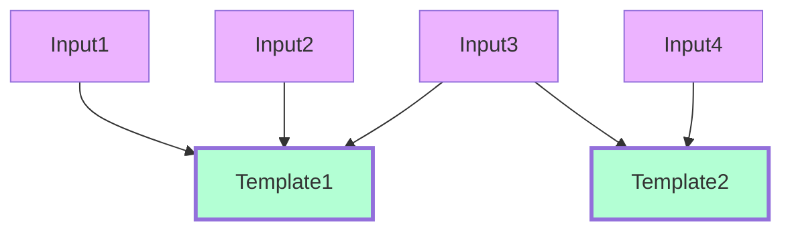
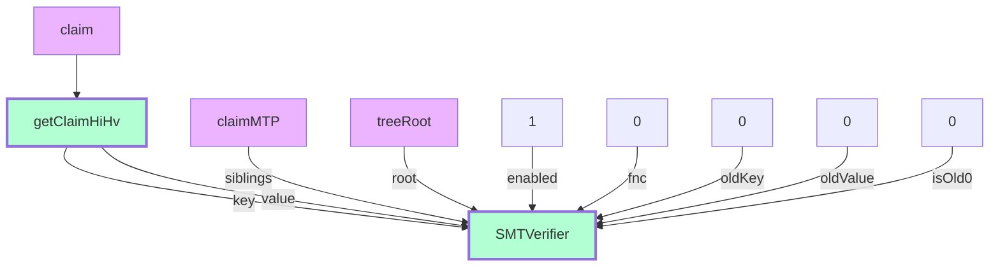
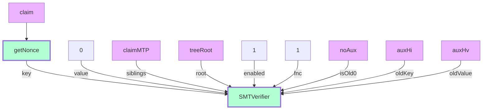
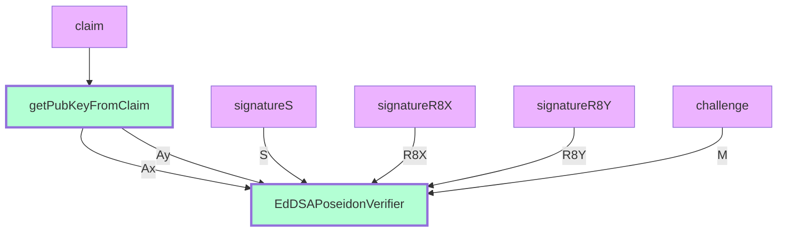
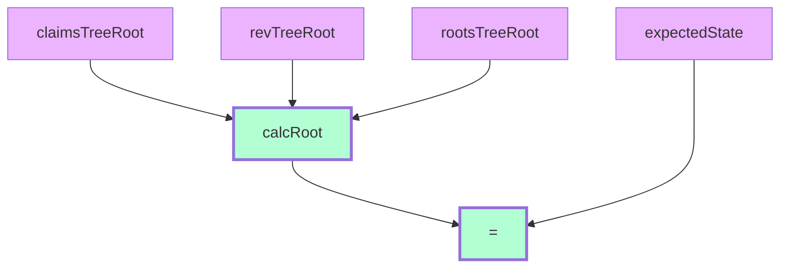

# Circuits

## Template Docs Example

Let's understand how circuits and templates can be described by their graphs. Just compare the following .circom code with its visual graph displayed underneath.

The code:
```
template Example () {
signal input input1;
signal input input2;
signal input input3;
signal input input4;
signal input input5;

    component template1 = Template1();
    template1.in1 = input1;
    template1.in2 = input2;
    template1.in3 = input3;

    component template2 = Template2();
    template2.in1 = input3;
    template2.in2 = input4;
}
```

The graph:



## Basic Templates

Basic templates are not used independently to create circuits but are used as the building blocks for other templates.

### checkClaimExists
This circuit checks if a claim exists in the sparse Merkle tree. By "exists", we mean that a value Hv (hash of all values slots) is located by path Hi (hash of all index slots) in the tree.



### checkClaimNonRev

The circuit checks that the claim does not exist in the sparse Merkle tree. That means that the tree leaf is empty by a path, which is defined by the claim nonce.



### checkChallengeSignature

This circuit checks if the challenge signature is correct. The public key for verification is extracted from the claim.



### verifyIdenStateMatchesRoot

The circuit calculates the identity state from the three Merkle tree roots and checks if it is equal to the expected state.



### Query

This circuit checks that an expression within an operator and its value are true.

For example in="1", operator="4", value=["5","2","3"] is true because "4" is "not in" operator and "1" is not in the ["5","2","3"] array.

See all the operators in the circuit comments. The circuit graph is not represented here due to complexity.

## Functional Templates

These are the templates that the Iden3 system mostly uses to generate and verify proofs directly. A functional template may use other functional templates as its building blocks.

### idOwnershipBySignature
This circuit checks the ownership of a specific identity in the following way:

1. The claim with the public key should exist in the claims tree.
2. The claim with the public key should not be revoked.
3. The signature of a challenge should be valid.
4. The state should be equal to "expected" from the blockchain.

The above criteria enable a verifier to check that the challenge is signed by an identity, which state is timestamped on the blockchain and if it includes the non-revoked claim with the relevant public key.

### CredentialAtomicQueryMTP
This circuit checks that an issuer has issued a claim for identity and validates the ownership of that identity in the following manner:

1. Checks the identity ownership by idOwnershipBySignature template
2. Verifies the claim subject, the schema and the expiration time.
3. Checks if the issuer claim exists in the issuer claims tree.
4. Checks if the issuer claim is not revoked by an issuer.
5. Checks if the issuer claim satisfies a query.

### CredentialAtomicQuerySig
This circuit checks that an issuer has issued a claim for identity and validates ownership of that identity in the following manner:

1. Checks the identity ownership by idOwnershipBySignature template.
2. Verifies the claim subject, the schema and the expiration time
3. Checks if the issuer claim exists in the issuer claims tree.
4. Verifies the claim signature by the issuer.
5. Verifies if the issuer state matches with the one from the blockchain as the public input.
6. Checks if the issuer claim satisfies a query.
 