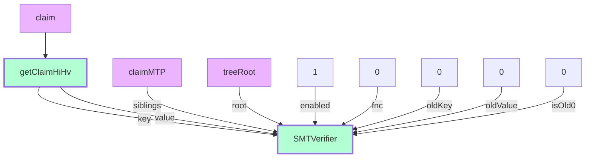
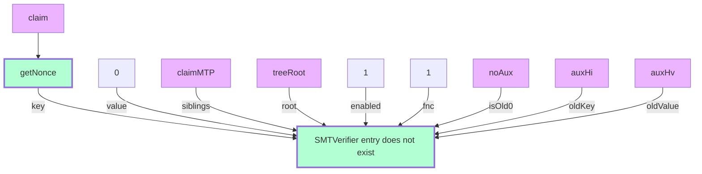
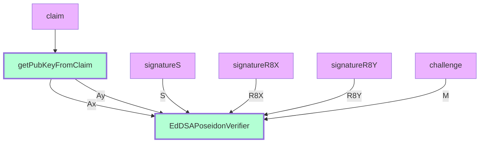
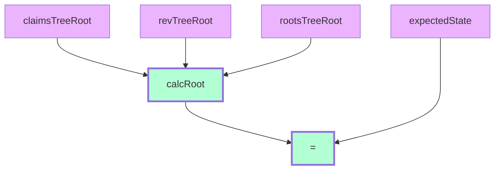
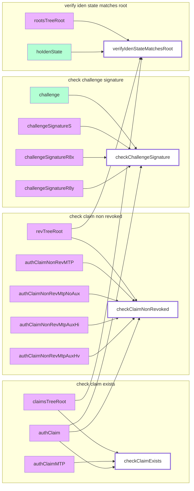
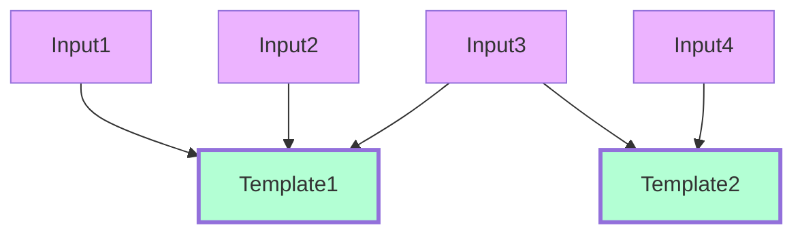

# Circuits

## Basic templates

These are templates which are not used independently to create circuits but rather as building blocks for other templates.

### checkClaimExists
The circuit checks that the claim exists in the sparse merkle tree. By "exists" we mean that a value Hv (hash of all values slots) is located by path Hi (hash of all index slots) in the tree.



### checkClaimNonRev

The circuit checks that the claim does not exist in the sparse merkle tree. That means that the tree leaf is empty by a path, which is defined by the claim nonce.



### checkChallengeSignature

The circuit checks that the challenge signature is correct. The public key for verification is extracted from the claim.



### verifyIdenStateMatchesRoot

The circuit calculate identity state from three merkle tree roots and checks if it is equal to expected state.



### query

The circuit check that an expression with in, operator and value is true.

For example in="1", operator="4", value=["5","2","3"] is true because "4" is "not in" operator and "1" is not in the ["5","2","3"] array.

See all the operators in the circuit comments.

The circuit graph is not represented due to complexity.


## Functional templates

These are the templates which Iden3 system uses directly to generate and verify proofs. A functional template may use basic of other functional templates as building blocks.

The templates visualised as pivot tables. The columns of the tables are either basic templates or other functional templates.
The rows represent inputs or group of inputs of the template. The cells are marked with "+" if relevant input and template are connected.

See [template docs example](#template-docs-example) for

### idOwnershipBySignature
The circuits check ownership of specific identity as follows:

- The claim with public key should exist in claims tree
- The claim with public key should not be revoked
- The signature of a challenge should be valid
- The state should equal to expected from blockchain

The above enable verifier to check that some challenge is signed by identity which state is timestamped in blockchain and includes non revoked claim with relevant public key.

|                         | check Claim Exists | check Claim NonRevoked | check Challenge Signature | verify Iden State Matches Root |
|-------------------------|:------------------:|:----------------------:|:-------------------------:|:------------------------------:|
| claimsTreeRoot          |          +         |                        |                           |                +               |
| authClaimMTP            |          +         |                        |                           |                                |
| authClaim               |          +         |            +           |             +             |                                |
| revTreeRoot             |                    |            +           |                           |                +               |
| authClaimNonRevMTP      |                    |            +           |                           |                                |
| authClaimNonRevMtpNoAux |                    |            +           |                           |                                |
| authClaimNonRevMtpAuxHi |                    |            +           |                           |                                |
| authClaimNonRevMtpAuxHv |                    |            +           |                           |                                |
| rootsTreeRoot           |                    |                        |                           |                +               |
| challenge               |                    |                        |             +             |                                |
| challengeSignatureS     |                    |                        |             +             |                                |
| challengeSignatureR8x   |                    |                        |             +             |                                |
| challengeSignatureR8y   |                    |                        |             +             |                                |
| hoIdenState             |                    |                        |                           |                +               |

### idOwnershipBySignature (graph experiment)




### CredentialAtomicQueryMTP
The circuits check that an issuer have issued claim for identity and validates ownership of that identity as follows:

- Check identity ownership by idOwnershipBySignature template
- Check issuer claim exists in issuer claims tree
- Check issuer claim is not revoked by an issuer
- Check the issuer claim satisfies a query

|                                 | IdOwnership BySignature | verify Credential Subject | verify Credential Schema | verify Expiration Time | verify Claim Issuance NonRev | Query |
|---------------------------------|:-----------------------:|:-------------------------:|:------------------------:|:----------------------:|:----------------------------:|:-----:|
| id                              |                         |             +             |                          |                        |                              |       |
| (idOwnershipBySignature inputs) |            +            |                           |                          |                        |                              |       |
| claimSchema                     |                         |                           |             +            |                        |                              |       |
| claim                           |                         |             +             |             +            |            +           |               +              |   +   |
| claimIssuanceMtp                |                         |                           |                          |                        |               +              |       |
| claimIssuanceClaimsTreeRoot     |                         |                           |                          |                        |               +              |       |
| claimIssuanceRevTreeRoot        |                         |                           |                          |                        |               +              |       |
| claimIssuanceRootsTreeRoot      |                         |                           |                          |                        |               +              |       |
| claimIssuanceIdenState          |                         |                           |                          |                        |               +              |       |
| issuerID                        |                         |                           |                          |                        |                              |       |
| claimNonRevMtp                  |                         |                           |                          |                        |               +              |       |
| claimNonRevMtpNoAux             |                         |                           |                          |                        |               +              |       |
| claimNonRevMtpAuxHi             |                         |                           |                          |                        |               +              |       |
| claimNonRevMtpAuxHv             |                         |                           |                          |                        |               +              |       |
| claimNonRevIssuerClaimsTreeRoot |                         |                           |                          |                        |               +              |       |
| claimNonRevIssuerRevTreeRoot    |                         |                           |                          |                        |               +              |       |
| claimNonRevIssuerRootsTreeRoot  |                         |                           |                          |                        |               +              |       |
| claimNonRevIssuerState          |                         |                           |                          |                        |               +              |       |
| slotIndex                       |                         |                           |                          |                        |                              |   +   |
| value                           |                         |                           |                          |                        |                              |   +   |
| operator                        |                         |                           |                          |                        |                              |   +   |
| timestamp                       |                         |                           |                          |            +           |                              |       |

### CredentialAtomicQuerySig
[TBD] description...

|                                 | IdOwnership BySignature | verify Credential Subject | verify Credential Schema | verify Expiration Time | verify Issuer Auth Claim | verify Claim Signature | verify Iden State Matches Root | verify Credential Not Revoked | Query |
|---------------------------------|:-----------------------:|:-------------------------:|:------------------------:|:----------------------:|:------------------------:|:----------------------:|:------------------------------:|:-----------------------------:|:-----:|
| id                              |                         |             +             |                          |                        |                          |                        |                                |                               |       |
| (idOwnershipBySignature inputs) |            +            |                           |                          |                        |                          |                        |                                |                               |       |
| claimSchema                     |                         |                           |             +            |                        |                          |                        |                                |                               |       |
| claim                           |                         |             +             |             +            |            +           |                          |             +          |                                |               +               |       |
| claimSignatureR8x               |                         |                           |                          |                        |                          |             +          |                                |                               |       |
| claimSignatureR8y               |                         |                           |                          |                        |                          |             +          |                                |                               |       |
| claimSignatureS                 |                         |                           |                          |                        |                          |             +          |                                |                               |       |
| issuerID                        |                         |                           |                          |                        |                          |                        |                                |                               |       |
| issuerIdenState                 |                         |                           |                          |                        |                          |                        |                                |                               |       |
| issuerClaimsTreeRoot            |                         |                           |                          |                        |             +            |                        |                                |                               |       |
| issuerRevTreeRoot               |                         |                           |                          |                        |                          |                        |                                |                               |       |
| issuerRootsTreeRoot             |                         |                           |                          |                        |                          |                        |                                |                               |       |
| issuerAuthClaimMtp              |                         |                           |                          |                        |             +            |                        |                                |                               |       |
| issuerAuthHi                    |                         |                           |                          |                        |             +            |                        |                                |                               |       |
| issuerAuthHv                    |                         |                           |                          |                        |             +            |                        |                                |                               |       |
| issuerPubKeyX                   |                         |                           |                          |                        |             +            |             +          |                                |                               |       |
| issuerPubKeyY                   |                         |                           |                          |                        |             +            |             +          |                                |                               |       |
| claimNonRevMtp                  |                         |                           |                          |                        |                          |                        |                                |               +               |       |
| claimNonRevMtpNoAux             |                         |                           |                          |                        |                          |                        |                                |               +               |       |
| claimNonRevMtpAuxHi             |                         |                           |                          |                        |                          |                        |                                |               +               |       |
| claimNonRevMtpAuxHv             |                         |                           |                          |                        |                          |                        |                                |               +               |       |
| claimNonRevIssuerClaimsTreeRoot |                         |                           |                          |                        |                          |                        |                +               |                               |       |
| claimNonRevIssuerRevTreeRoot    |                         |                           |                          |                        |                          |                        |                +               |               +               |       |
| claimNonRevIssuerRootsTreeRoot  |                         |                           |                          |                        |                          |                        |                +               |                               |       |
| claimNonRevIssuerState          |                         |                           |                          |                        |                          |                        |                +               |                               |       |
| slotIndex                       |                         |                           |                          |                        |                          |                        |                                |                               |   +   |
| value                           |                         |                           |                          |                        |                          |                        |                                |                               |   +   |
| operator                        |                         |                           |                          |                        |                          |                        |                                |                               |   +   |
| timestamp                       |                         |                           |                          |            +           |                          |                        |                                |                               |       |

## Template docs example

This is to understand what pivot tables of functional template mean.
Let's say we have the following example template .circom
```
template Example () {
signal input input1;
signal input input2;
signal input input3;
signal input input4;
signal input input5;

    component template1 = Template1();
    template1.in1 = input1;
    template1.in2 = input2;
    template1.in3 = input3;

    component template2 = Template2();
    template2.in1 = input3;
    template2.in2 = input4;
}
```
So the graph for the template would be

and a pivot table

|        | Template1 | Template2 |
|--------|-----------|-----------|
| Input1 | +         |           |
| Input2 | +         |           |
| Input3 | +         | +         |
| Input4 |           | +         |
