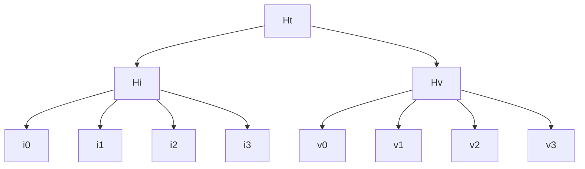

# Claim Data Structure



## Common Structure

A claim always contains a subject, that can be:
- **Self**: The claim says something about itself.  The subject is implicit, and it's the identity that makes claim.
- **OtherIden**: The claim says something about some other identity (identifies by other's ID).
- **Object**: The claim says something about an object (identifies by the object's ID).

If the subject is _Self_ -  _identity_, sections  i_1, v_1 can be empty. 

if the subject is NOT _Self_, the id(OtherIden) of the Identity/Object can be in the Index(i_1) or the Value(v_1) part of the claim.  This is encoded in a header bit.

```go
h_i = H(i_0, i_1, i_2, i_3)
h_v = H(v_0, v_1, v_2, v_3)
h_t = H(h_i, h_v)

Index:
 i_0: [ 128 bits ] claim schema
      [ 32 bits ] header flags
          [3] Subject:
            000: A.1 Self
            001: invalid
            010: A.2.i OtherIden Index
            011: A.2.v OtherIden Value
            100: B.i Object Index
            101: B.v Object Value
          [1] Expiration: bool
          [1] Updatable: bool
          [27] 0
      [ 32 bits ] version (optional?)
      [ 61 bits ] 0 - reserved for future use
 i_1: [ 248 bits] identity (case b) (optional)
      [  5 bits ] 0
 i_2: [ 253 bits] 0
 i_3: [ 253 bits] 0
Value:
 v_0: [ 64 bits ]  revocation nonce
         [ 64 bits ]  expiration date (optional)
         [ 125 bits] 0 - reserved
 v_1: [ 248 bits] identity (case c) (optional)
        [  5 bits ] 0
 v_2: [ 253 bits] 0
 v_3: [ 253 bits] 0
```

### Claim Schema 
Schemas define the type of data inside a claim [link](../spec#claims).

_Index slots_ **i_2**, **i_3** and _value slots_ **v_2**, **v_3** are the data slots for user data.

#### Index vs Value 
**When to Use Index Slots and Value Slots?**

Claims are stored in the Merkle tree and the hash of the index slots ( hash(i_0,i_1,i_2,i_3) ) is unique for the whole tree. It means that you cannot have two claims with the same index inside the tree. 

As opposite to the index, the values slots could be the same for different claims if their indexes are different. 