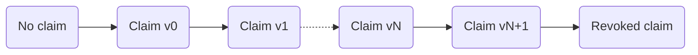
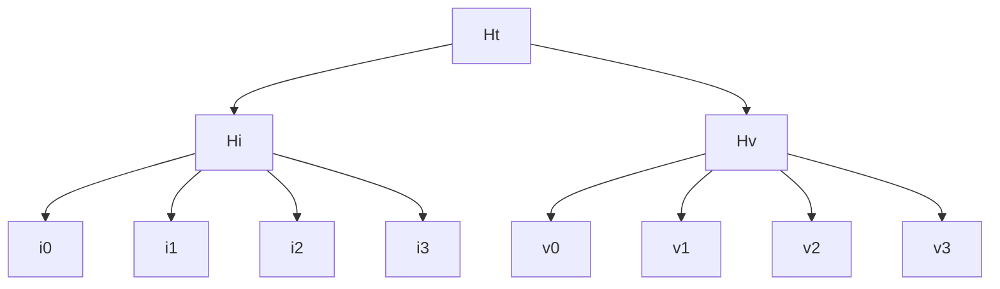
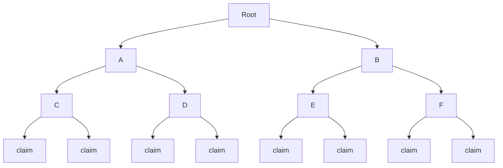
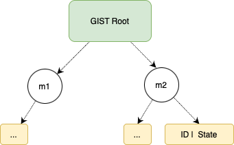
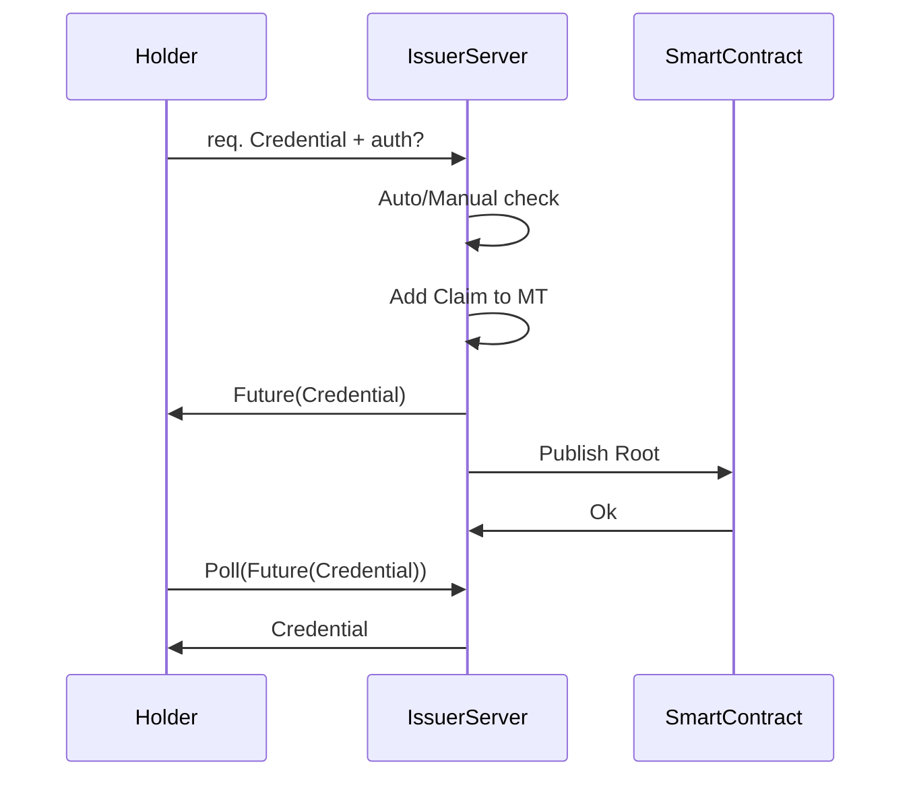
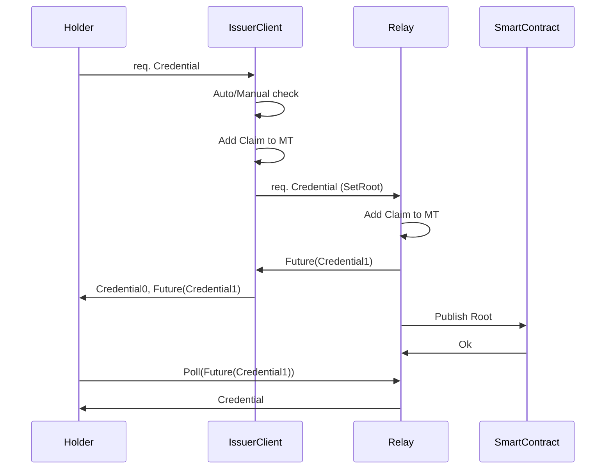

#  Iden3 Protocol Specifications (Version 0)

> These specifications are under development and are being updated regularly. Consider it as a work-in-progress.

## Basis

### Glossary

- **Issuer**: An actor who makes a claim.
- **Holder**: An actor who receives a claim.
- **Verifier**: An actor who verifies if the content of a claim is issued by a specific identity and held by another specific identity.
- **Credential**: Data that is needed to prove that a claim is issued by a specific identity and held by another specific identity. This data is composed of **a claim and a proof**.

### Merkle Tree

A Merkle tree (MT) or a hash tree is a cryptographically verifiable data structure where every "leaf" node of the tree contains the cryptographic hash of a data block, and every "non-leaf" node contains the cryptographic hash of its child nodes.

The MTs used in the protocol have a few particularities:
- **Binary**: Each node can only have two children.
- **Sparse and Deterministic**: The contained data is indexed, and each data block is placed at the leaf that corresponds to that data block's index, so insert order doesn't influence the final Merkle tree Root. This also means that some nodes are empty.
- **ZK-friendly**: The used hash function, [poseidon](https://www.poseidon-hash.info/), plays well with the zero-knowledge proofs (ZKP) used in different parts of the protocol.

In order to ensure that these particularities are respected and to have a history of all the changes that occurred on different trees (without revealing the actual content stored in the leaves), **the root of each MT is indirectly stored on the blockchain**. The EVM-based blockchains are chosen for this purpose.

The `Merkle tree` specification is defined in [this document](https://github.com/iden3/iden3-docs/blob/master/source/docs/MerkleTree.pdf). In future, the MT implementation could be changed.

### Zero-knowledge Proof (ZKP)

In cryptography, a zero-knowledge proof is a method by which one party (the prover) can prove to a second party (the verifier) that the prover knows a value x (that fulfills some constraints), without revealing any other information apart from the fact that s/he knows the value x.

The technologies that implement these techniques are evolving rapidly. As of now, the protocol uses zkSNARKs Groth16, but in future, the zk protocol could be changed.
zkSNARK stands for "Zero-knowledge Succinct Non-interactive Argument of Knowledge", and has the following properties:

- **Non-interactive**: With a single message (credential) from the prover, the verifier can verify the proof.  This is good because it allows sending proofs to a smart contract that can verify these proofs immediately.
- **Efficient Verification**: It is computationally efficient to verify proofs, both in terms of the size and the operations. This is apt for the protocol because verification happens on the blockchain with its inherent costs.
- **Heavy Proof Generation**: Generating a proof is computationally very expensive and can be time-consuming even with powerful hardware.
- **Setup**: A pre-existing setup between the prover and the verifier is required for the construction of zkSNARKs. In order to ensure that the verifier cannot cheat, one has to be sure that the keys used for the setup have been destroyed. There are protocols to ensure that, resulting in a "trusted setup".

Read more technical information about zkSNARKs in [this article](https://medium.com/@VitalikButerin/zk-snarks-under-the-hood-b33151a013f6) by Vitalik Buterin.

## Claims

### Definition

A claim is a statement made by one identity about another identity or about itself. Each claim is composed of two parts: the index part and the value part.
Claims are stored on the leaves of an MT. The index is hashed and is used to determine the leaf position where the value of the claim will be stored.
A special transition validation function can be used to restrict how leaves are stored on the Merkle tree, i.e. make the MT append-only, (leaves can only be added and cannot be updated or deleted).

### Properties

- It is impossible to generate proof of a statement on behalf of an identity without its consent.
- Claims can be revoked.
- Claims can be updated by creating new versions. When a claim is revoked, no further versions can be made. Claims can be set to be updatable or not with a flag (See [**Claim Structure**](https://github.com/iden3/docs/blob/master/mkdocs/docs/protocol/spec.md#structure)).



- Claims can be verified. This means that it is possible to demonstrate cryptographically that a given claim is:
    - Issued by a specific identity.
    - Not revoked.
    - Is of the last version of that claim if it is updatable.
- There are two types of claims regarding destination:
    - Claims about identity's own properties. Example: Operational Key, Ethereum Address, etc.
    - Claims about another identity's properties:
        - **(Another) Identity has a Property**: Directional relation between an identity and a property (See [**Claim Structure**](https://github.com/iden3/docs/blob/master/mkdocs/docs/protocol/spec.md#structure): identity stored in hIndex, i_1).
        - **Property is Owned by (Another) Identity**: Directional relation between a property and an identity (See [**Claim Structure**](https://github.com/iden3/docs/blob/master/mkdocs/docs/protocol/spec.md#structure): identity stored in hValue, v_1).

> NOTE: Some of these properties are only guaranteed by a transition validation function (explained above in this document).

### Structure

```
h_i = H(i_0, i_1, i_2, i_3)
h_v = H(v_0, v_1, v_2, v_3)
h_t = H(h_i, h_v)
```



```
Index:
 i_0: [ 128  bits ] claim schema
      [ 32 bits ] option flags
          [3] Subject:
            000: A.1 Self
            001: invalid
            010: A.2.i OtherIden Index
            011: A.2.v OtherIden Value
            100: B.i Object Index
            101: B.v Object Value
          [1] Expiration: bool
          [1] Updatable: bool
          [3] Merklized: data is merklized root is stored in the:
            000: none
            001: C.i Root Index (root located in i_2)
            010: C.v Root Value (root located in v_2)
          [24] 0
      [ 32 bits ] version (optional?)
      [ 61 bits ] 0 - reserved for future use
 i_1: [ 248 bits] identity (case b) (optional)
      [  5 bits ] 0
 i_2: [ 253 bits] 0
 i_3: [ 253 bits] 0
Value:
 v_0: [ 64 bits ]  revocation nonce
      [ 64 bits ]  expiration date (optional)
      [ 125 bits] 0 - reserved
 v_1: [ 248 bits] identity (case c) (optional)
      [  5 bits ] 0
 v_2: [ 253 bits] 0
 v_3: [ 253 bits] 0
```

### Reliability of a Claim Content

The correctness of what is said in a claim is not verifiable by a protocol since every identity is free to claim whatever it wants. Since it is possible to know which identity issued which claim, the trust/reputation that the issuer has can affect its credibility.

However, the protocol can guarantee exclusivity: there cannot be two claims with the same index. So it is impossible that an identity claims that a property (index part of the claim) is linked to two different identities (value part of the claim) at the same time.

## Keys

Keys are cryptographic elements that can be used to sign data. In a protocol, keys are used to authenticate certain interactions.

These keys require the authorization of the identity (who owns these keys). This is done by adding a claim with a specific schema, linking the key(s) with the identity. 

This way, each time that a key is used for signing, the identity can (and must) prove the ownership of that key and the fact that the key is not revoked.

<!-- ==**TODO**==
== - Explain what role the keys play in the iden3 protocol. Authenticate! Explain that the keys are used to sign to authenticate an identity ==
== - And that in the case of zero-knowledge, it is not done as it would be done 'traditionally', but that the zero-knowledge proof itself already shows that the sender knows the private key == -->

### Types of Keys

- Baby Jubjub: Used for authentication. This type of key is designed to be efficient while working with zkSNARKs.
  The `Baby Jubjub Elliptic Curve` specification is defined in [this document](https://github.com/iden3/iden3-docs/blob/master/source/docs/Baby-Jubjub.pdf).


## Identity

### Definition

An `identity` is characterized by the claims that the identity has issued, and the claims that the identity has received from other identities. In other words, an identity is built by what the identity has said, and what others have said about the identity.

Each claim that an identity issues can be cryptographically proved and verified, ensuring that the claim existed under identity at a certain timestamp.



To accomplish this (and other properties covered in this document), identities are built by [Merkle trees](#MerkleTree), where the claims are placed as the leaves, and the `Root` is published (indirectly through the identity state) on the blockchain. With this construction, the identities can issue, update, and revoke claims.

The protocol construction is designed to enable zero-knowledge features. It means that the identities have the ability to prove the ownership of the properties of the claims in issued and received claims and verify that a particular claim is not revoked.

### Genesis ID

#### Description

Each identity has a unique `identifier` that is determined by the initial identity state (hash of its Merkle Tree Roots). This identifier is called `Genesis ID`, under which the initial claims are placed (those that are contained in the initial state of the identity).

<!-- TODO: For the initial implementation of the protocol, the Genesis Claims Tree will contain at least a [claim of authorization of the Operational key](#link-to-the-spec-of-the-claim-once-is-done), that allows operating in the name of identity. -->
For the initial implementation of the protocol, the Genesis Claims Tree will contain at least a claim of authorization of the Operational Key that allows operation in the name of identity.
 <!-- (identities operated by smart contracts are not specified in this version). -->

While an identity does not add, update or revoke claims after the Genesis State, its identity state does not need to be published on the blockchain, and the `Genesis Claims` can be verified directly against the `Genesis ID`. This is because the Genesis ID is built by the Merkle Root that holds those claims.

> NOTE: The Genesis ID is calculated with the Identity State as a hash of the Genesis Claims Tree Root, an empty Revocation Tree Root and an empty Roots Tree Root.

#### Identifier Format

An Identifier is determined by its identity type and the `Genesis Identity State` (also called the `Genesis ID`). This is built by creating a Merkle Tree that holds the initial state claims, calculating its root, and hashing it together with an empty Revocation Tree Root & an empty Roots Tree Root. Then we take the first 27 bytes of this result and add to it 2 bytes at the beginning (to specify the identity type), and 2 bytes at the end (for checksum).Thus, in total, an identifier is a byte array of 31 bytes, encoded in base58.

An **identity type** specifies the specifications that an identity follows (such as the hash function used by the identity). In this way, when the hash function changes, the identifiers of the identities will also change, allowing us to identify the type of identity.

**Identifier Structure**:
- `ID` (genesis): Base58 [ `type` | `genesis_state` | `checksum` ]
	- `type`: 2 bytes specifying the type
	- `genesis_state`: First 27 bytes from the identity state (using the Genesis Claim Merkle tree)
	- `checksum`: Addition (with overflow) of all the ID bytes Little Endian 16 bits ( [ `type` | `genesis_state` ] )


#### Identity State 

The **identity states** are published on the blockchain under the identifier, anchoring the state of the identity with the timestamp when it is published. In this way, the claims of the identity can be proved against the anchored identity state at a certain timestamp. To transition from one state to the other, identities follow the transition functions.

The identity states can be published on the blockchain in one of the two ways: **directly** performing the transaction to publish the root or **indirectly** using a Relay. 
<!-- The indirect method is described in the section [Indirect Identities](#Indirect-identities). -->

The `Genesis State` is the initial state of any identity, and does not need to be published on the blockchain, as the claims under it can be verified against the identifier itself (that contains that identity state).


#### Identity State Transition Function
The `ITF` (Identity State Transition Function) is verified each time a state is updated. This ensures that the identity follows the protocol while updating.

An Identity Merkle tree is a sparse binary tree that allows only the addition of the leaves (no edition or deletion). Adding new claims, updating them through versions and revoking need to be done according to the `ITF`. To ensure this, we use zero-knowledge proofs in a way that when an identity is publishing a new state to the smart contract, it also sends a zero-knowledge proof (`π`), proving that the `ϕ` is satisfied following the `ITF`. In this way, all the identity states published on the blockchain are validated to be following the protocol.

> NOTE: In the initial version of the implementation, there will be no checks to verify that the trees are append-only in the smart contract. This is due to the fact that complex computations are required to generate the zk proofs for multiple claim additions, (a requirement for scalability).

The full circuit can be found here: https://github.com/iden3/circuits/blob/master/circuits/stateTransition.circom

### Identity Profiles (NEW)

Identity Profiles allow users to hide their [`Genesis ID`](#genesis-id) during interactions. Instead, users will be identified by their `Identity Profile`.

An Identity Profile is generated from the `GenesisID` and hashing it with a (random) nonce. 

`Identity Profile` has the same [structure as the `Genesis ID`](./spec.md#identifier-format). It is a byte array of 31 bytes, encoded in base58.

[ `IDtype` (2 bytes) | `profile_state` (27 bytes) | `checksum` (2 bytes) ]

- `IDtype` :  inherited type from `Genesis ID`
- `profile_state` : First 27 bytes from the poseidonHash(`Genesis ID`, `profile_nonce`), where `profile_nonce` is any random number
- `checksum` Addition (with overflow) of all the ID bytes Little Endian 16 bits ([ `typeID`| `profile_state`])

<!-- > Here's how the [checksum](https://github.com/iden3/go-iden3-core/blob/2f1886532b353d1eb550ccc790cb5a6dc5bc7b32/core/id.go#L118) is calculated -->

Identity Profiles are irreversible and indistinguishable:

- **Irreversible**, thanks to the properties of the underlying hash function, meaning that it is impossible to retrieve the `Genesis ID` from an `Identity Profile`, unless you know the nonce.  
- **indistinguishable**, the data format of Identity Profiles is the same as Genesis IDs. It follows that an external party cannot tell if an identity is using its Genesis ID or one of its many Identity Profiles.

An Identity can receive claims to a specific Identity Profile. An Identity Profile keeps all the properties of [Genesis IDs](#genesis-id)) while adding:

- **Anti-track**

Since users are no longer consistently identified with the same identifier in their interactions across different platforms, it becomes harder to track the action of a single user. Even if platforms collude. Even more, the user can interact with the same platform using different Identity Profiles, making it impossible to track the user across different interactions inside the same platform.

- **Faculty to decide which profile to show**

Users can decide which profiles to show as it is only based on the nonce. An Identity can create an Identity Profile and reuse it across interaction with different actors, for example in the case of a Profile with all their business information just by reusing the same nonce. For interactions that require the maximum level of privacy, an Identity can create a single-use Identity Profile by choosing a random nonce and never reusing it again. 

- **Reusability of claims across different profiles**

Users can get claims issued to an Identity Profile (or to their Genesis ID) and generate proof, based on these claims, from a different Identity Profile. The Verifier will be only able to see a valid proof coming from the Identity Profile that the user decided to use. No connection between the two identities is leaked.

Despite being able to create multiples Identity Profiles, the control of the Identity is still still managed by the underlying [Private Key](./spec#keys)

<!-- Identity Profiles do not represent any additional attack vector for the security of the protocol. While the nonce has to be kept secret, losing the nonce will only reveal the link between the `Genesis ID` and an `Identity Profile` without any risk of losing control of the identity. **The control of an Identity is still managed by the underlying [Babyjubjub Private Key](./spec#keys)** -->

### GIST (NEW)

GIST, namely Global Identities State Tree, is a [Sparse Merkle Tree](../getting-started/mt.md) that contains the state of all the identities using Iden3 protocol. In particular, each leaf is indexed by the hash of its `Genesis ID` (key of the leaf) and contains the most recent state of that Identity (value of the leaf). 

The choice of using the hash of the Genesis ID as key of the leaf (instead of the Genesis ID itself) is to avoid that all the leaf accumulates in the same branch of the tree, since the Genesis ID has a fixed prefix. This would make the tree very unbalanced and inefficient. Instead, by using the hash of the Genesis ID, we randomize the position of the leaf in the tree, making it more balanced.

The GIST is stored inside the [State Contract](../contracts/state.md). Every time a user executes a [State Transition function](../getting-started/state-transition/state-transition.md), the new state of an identity is [added to the GIST stored on-chain](https://github.com/iden3/contracts/blob/master/contracts/state/StateV2.sol#L190)

```solidity
gistTree.add(H(genesisID), state)
```

This design allows users to prove ownership of an Identity by proving that this is included in the GIST without revealing which one is their Genesis ID!

<div align="center">

<div align="center"><span style="font-size: 17px;"></div>
</div>

<!--
##### Direct identity ITF_min

###### Addition of non-updatable claim
Prove that a leaf in the MT (claim) is only added but never deleted nor changed

- `R_i -> leaf_claim==0`
- `R_i+1 -> leaf_claim==claim`
> 2 MerkleProofs with same siblings

###### Addition of claim with versions
- `v0`
    - `R_i -> leaf_claim_v0==0`
    - `R_i+1 -> leaf_claim_v0==claim_v0`
> 2 MerkleProofs with same siblings

If an updatable claim is added to the MT with version `v!=0`, claim version `v-1` must already exist in the MT

- `v_n+1`
    - `R_i -> leaf_claim_vn==claim_vn`
    - `R_i -> leaf_claim_vn+1==0`
    - `R_i+1 -> leaf_claim_vn+1==claim_vn+1`
> 1 MerkleProof with siblings
> 2 MerkleProof with same siblings
-->

<!-- ##### Indirect identity ITF_min
==TODO== -->

### Identity Ownership

We prove the identity ownership inside a zkSNARK proof. This means that the user can generate a zk-proof that s/he knows a `private key` corresponding to the `operational key for authorization` claim added to the Claims Tree, without revealing the `claim` and its position. This is coded inside a circom circuit, which can be used in other circuits (such as the `id state update` circuit).

The full circuit can be found here: https://github.com/iden3/circuits/blob/master/circuits/lib/idOwnershipBySignature.circom

### Identity Key Rotation

An identity can self-issue and revoke many `private keys` and the corresponding `claims` of the type `operational key authorization`, enabling key rotation. To support verification of such claims, an identity state should be publicly available on the blockchain. An identity can publish the state to the blockchain directly or via the Relay.

Any private key for which a corresponding claim exists in the Identity Claims Tree and does not exist in the Identity Revocation Tree, can be used to create a zero-knowledge proof for valid credentials. Such proof should pass verification by a verifier as it is able to check the latest identity state in the blockchain.

In the same way, any valid and non-revoked identity private key can be used to create a valid zk proof for the Identity State Transition Function.

> NOTE: An identity may lose some privacy while disclosing its state to a verifier, which can track all the proofs of the same identity in that manner. However, this issue can be mitigated if the identity state is published to the blockchain via a Relay. In such a case, only the Relay state needs to be disclosed to a verifier.

<!-- ==TBD: Identity recovery procedure in case of a private key and state database loss== -->

### Identity Revocation

When an identity revokes all the `claims` of the type `operational key authorization`, it is considered `revoked` as this identity can no longer create proofs.

## Interaction between Identity and Claims

### Identity State Update

The Identity State Update is the procedure used to update information about what this identity has claimed. This involves three different actions:
- Add a claim.
- Update a claim (by incrementing the version and changing the claim value part).
- Revoke a claim.

<!--
The Identity State Update can be generalized as an `ITF_min` (minor Identity Transition Function) that performs a minor update of the identity (where a minor update only concerns the claims of the identity but not the identity itself).
-->

#### Definitions

- `IdS`: Identity State
- `ClT`: Claims Tree
    - `ClR`: Claims Tree Root
- `ReT`: Revocation Tree
    - `ReR`: Revocation Tree Root
- `RoT`: Roots Tree
    - `RoR`: Roots Tree Root

The `IdS` (Identity State) is calculated by concatenating the roots of the three user trees:
- `IdS`: `H(ClR || ReR || RoR)`where `H` is the Hash function defined by the Identity Type (for example, Poseidon).

All trees are SMT (sparse Merkle trees) and use the hash function defined by the Identity Type.
- Leaves in `ClT` (Claims Tree) are claims ((4 + 4) * 253 bits = 253 bytes)

See [**Claim Structure**](https://github.com/iden3/docs/blob/master/mkdocs/docs/protocol/spec.md#structure)
- Leaves in `ReT` (Revocation Tree) are Revocation Nonce + Version (64 bits + 32 bits = 12 bytes)
```
Revocation Tree Leaf:
leaf: [ 64 bits ] revocation nonce
      [ 32 bits ] version
      [157 bits ] 0
```
- Leaves in `RoT` (Roots Tree) are tree roots (from the Claims Tree) (253 bits = 32 bytes)
```
Roots Tree Leaf:
leaf: [253 bits ] tree root
```


> Identity State Diagram for Direct Identity

As seen in the diagram, only the `IdS` is stored on the blockchain.  In order to save the stored bytes on the blockchain, it is desirable that only one "hash" representing the current state of the Identity is stored on the smart contract. This one "hash" is the `IdS` (Identity State), which is linked to a timestamp and a block on the blockchain.

All the public data must be made available for any holder so that
they can build fresh Merkle tree proofs of both the `ReT` and `RoT`.  This allows the holder to:

- Prove recent non-revocation / "current" version without interaction with the issuer.
- Hide a particular `ClR` from all the other`ClR`s to avoid an issuer from discovering a claim hidden behind a zk proof. For this purpose, `ClR` is added to `RoR`.

The place and the method to access the publicly available data are specified in the Identities State smart contract. Two possible initial options are:

- IPFS, by adding a link to an [IPNS address](https://docs.ipfs.io/guides/concepts/ipns/) (example: `ipfs://ipns/QmSrPmbaUKA3ZodhzPWZnpFgcPMFWF4QsxXbkWfEptTBJd`), which contains a standardized structure of the data.
- HTTPS, by adding a link to an HTTPS endpoint (example: `https://kyc.iden3.io/api/v1/public-state/aabbccdd`), which offers the data following a standardized API.

#### Publish Claims

The first step in publishing a claim involves adding a new leaf to the `ClT`, which updates the identity `ClR`. Claims can be optionally published in batches, adding more than one leaf to the `ClT` in a single transaction. After the `ClT` has been updated, the identity must follow an Identity State Update so that anyone is able to verify the newly added claims. This involves adding the new `ClR` to the `RoT`, which in turn will update the `RoR`. Post that, the new `IdS` is calculated and through a transaction it is updated in the Identities State Smart Contract (from now on, referred to as "the smart contract") on the blockchain. Once the updated `IdS` is in the smart contract, anyone can verify the validity of the newly added claims.

The procedure to update the `IdS` in the smart contract can be achieved with the following criteria:
- **Bad scalability (no batch), good privacy, and correctness**: The identity uploads the new `IdS` to the smart contract with proof of a correct transition from the old `IdS` to the new one. Only one claim is added to the `ClT` in the transition.
- **Good scalability (batch), good privacy, and correctness**: Same as before, but many claims are added (batch) in the transition (with a single proof for all newly added claims)
- **Good scalability (batch), good privacy but no correctness**: The identity uploads the new `IdS` to the smart contract, without proving correctness on the transition.

The criteria for correctness are as follows:
- Revocation of a claim cannot be reverted.
- Updatable claims are only updated with increasing versions, and only one version is valid at a time.

To have or to not have the guarantee of the correctness is specified in the Identity Type so that any verifier knows about the guarantees provided by the protocol for the issuer claims.

> NOTE: Good scalability refers to the verification process and the costs related to the smart contract. Batching with zkSNARKs can have a high computation load on the prover.

#### Revocation Tree

Sometimes, it is desirable for an identity to invalidate a statement made through a claim. For regular claims, this involves revoking (a process that is ideally irreversible) and allows any verifier to be aware that an already published claim is made invalid by the issuer's identity. Similarly, for updatable claims, there must be a mechanism to invalidate old versions when a new one is published. Since confirming the current validity of a claim is a parallel process to confirming that a claim was published at some point, the "current validation" process can be separated.

Separating these two processes allows a design in which the `ClT` (Claim Tree) remains private, but the revocation/version information is public, allowing a holder to generate a fresh proof of the "current validity" without requesting access to the private `ClT`.

To achieve this, every Identity has a `ClT` (Claim Tree) and a separate `ReT`(Revocation Tree). While the Claim Tree would be private and only the root public, the revocation tree would be entirely public. The roots of both the trees (`ClT` and `ReT`) are linked via the `IdS` (Identity State) which is published in the smart contract. The Revocation Tree could be published in IPFS or other public storage systems.

Proving that a claim is valid (and thus not revoked/updated) consists of two proofs:
- Prove that the claim was issued at some time t (this proof is generated once by the issuer and uses a `IdS`-`ClR` at time t stored in the smart contract).
- Prove that the claim has not been revoked/updated recently (this proof is generated by the holder with a recent `ReR` (Revocation Tree Root) by querying the public `ReT` (Revocation Tree), and verified against a recent `IdS`).

#### Revoke Claims

To prevent revealing anything about the content of the claim in the `ReT`, the claim contains a revocation nonce in the value part, which is added as a leaf in the `ReT` to revocate the claim.

To prevent reversing revocation of a claim, the `ReT` needs to follow some transition rules like `ClT`, enforced by a zk proof (for space and verification efficiency).

Apart from the revoking procedure, there is a method to define the validity of a claim based on expiration, by explicitly setting an expiration date in the claim (See [**Claim Structure**](https://github.com/iden3/docs/blob/master/mkdocs/docs/protocol/spec.md#structure)). Revoking and Expiration are compatible methods to invalidate claims.

#### Update Claims

To update a claim, a new claim is added to the `ClT` with an increased version value in the index position of the claim (notice that the previous version of the claim is not touched). Then, a leaf is added to the `ReT` containing the revocation nonce and the highest invalid version (that is, all the claims with that nonce and version equal or lower to the one in the leaf are invalid). This means that when a claim is updated, the same revocation nonce is used in the claim.

To prevent downgrading the version of a claim, and forcing to have only one valid updatable claim at a time, the `ReT` needs to follow the transition rules (like the `ClT` does) enforced by a zk proof (for space and verification efficiency).

Updating and revoking are compatible methods to invalidate claims: an updatable claim can be revoked, which means no future (or past) updates would be valid.

In case when a claim needs to be revoked completely, without the possibility to update, the highest version and the revocation nonce should be added to the `ReT`.

### Prove Claims (Credentials)

**Nomenclature**
- MTP: Merkle Tree Proof. The list of siblings in a path from a leaf to the root.

#### Prove that a Claim was Issued at Time t

- Requires proving a link between the claim and `IdS_t` (Identity State at time t) published in the smart contract. This proof requires:
    - Claim
    - t 
    - MTP Claim -> `ClR_t`
    - `RoR_t` (Roots Tree at time t)
    - `ReR_t` (Revocation Tree Root at time t)
    - `IdS_t`

where `t` is any time.

#### Prove that the Claim is Currently Valid

##### Prove that the Claim Hasn't Been Revoked Recently 
- Requires proving the inexistence of a link between the claim revocation nonce and a recent `IdS_t` (`t` must be recent according to the verifier requirements [1]) published in the smart contract.  This proof requires:
    - Claim (Nonce)
    - t (Recent Time)
    - MTP !Nonce -> `ReR_t`
    - `ClR_t`
    - `RoR_t`
    - `IdS_t`

[1] The verifier needs to decide a time span to define how recent the
`IdS_t` used in the proof needs to be.  Using the current `IdS`instead of recent could lead to data races, so it is better to select an `IdS` that is no more than X hours old.

##### Proof of Last Version

This is very similar to proving that a claim has not been recently revoked except that in this case, not only the nonce in the claim is checked, but also the version.
- Requires proving the inexistence of a link between the claim revocation nonce
  + version and a recent `IdS_t` (`t` must be recent according to the verifier requirements [1]) published in the smart contract.  This proof requires:
    - Claim (Nonce, Version)
    - t
    - MTP !(Nonce, Version) -> `ReR_t`
    - `ClR_t`
    - `RoR_t`
    - `IdS_t`

Where `t` is a recent time.

##### Proof of Non-Expiration

A claim can be made expirable by setting an expiration flag in the options and specifying an expiration date in the Unix timestamp format in the corresponding claim value part (see **Claim Format**).

#### Zero-knowledge Proof of Valid Credentials

A zero-knowledge proof allows hiding some information about a claim while proving that it was issued by a particular identity and that it is currently valid. The same checks mentioned in the previous sections are performed:
- Prove that a claim was issued at least at time t.
- Prove that the claim is currently valid.

In the proof that shows "that a claim was issued at time at least t", there is an additional part that is added to hide a particular `IdS_t1` that is used (in order to hide the claim from the issuer. See Appendix Title 2). The proof then requires:
    - Claim
    - t
    - MTP Claim -> `ClR_t1`
    - `RoR_t1` (Roots Tree at time t1)
    - `ReR_t1` (Revocation Tree Root at time t1)
    - `IdS_t1`
    - MTP `ClR_t1` ->`RoR_t2`
    - `ClR_t2` (Claims Tree Root at time t2)
    - `ReR_t2` (Revocation Tree Root at time t2)
    - `IdS_t2`

Where `t1` is any time and `t2` is the recent time.

The full circuit can be found at: https://github.com/iden3/circuits/tree/master/circuits/lib

<!--
[//]: # (### Indirect Identities)

[//]: # ()
[//]: # (Sometimes it's not practical for an Identity to publish its Identity State)

[//]: # (directly to the smart contract.  Some reasons could be:)

[//]: # (- The Identity publishes very few Claims and wants a more lightweight)

[//]: # (  procedure.)

[//]: # (- The Identity doesn't own cryptocurrency to call the smart contract.)

[//]: # (- The Identity wants to hide identifier from verifier.)

[//]: # ()
[//]: # (In those cases, the Identity must specify <!--in it's creation that it will be)

[//]: # (using a Relay which will indirectly link its claims to the smart contract via)

[//]: # (the Relay Identity State.  In this case, we say that the Identity under the)

[//]: # (Relay is an indirect Identity, and the Claims that an indirect Identity issues)

[//]: # (are Indirect Claims.)

[//]: # ()
[//]: # (Indirect claims are claims that appear in the user merkle tree whose Identity)

[//]: # (State appears in a SetRoot Claim that appears in the Relay merkle tree whose)

[//]: # (Identity State is in the blockchain.)

[//]: # ()
[//]: # (As mentioned, the claims of the Relay contain Identity States of other)

[//]: # (Identities.  If correctness guarantees are desired, updating these claims requires two levels of proofs:)

[//]: # (- Correct transition between the Relay Identity States)

[//]: # (- Correct transition between the Identity States that appear in the Relay Claims &#40;in the Relay Claims Tree&#41;)

[//]: # ()
[//]: # (This can be achieved through the following means with the following properties)

[//]: # (- *Bad scalability &#40;no batch&#41;, no privacy, correctness*: All the proofs are)

[//]: # (  public &#40;and long&#41;)

[//]: # (- *Bad scalability &#40;no batch&#41;, some privacy, correctness*: Only the user root)

[//]: # (  correct transition proofs are private &#40;zero-knowledge&#41;)

[//]: # (- *Good scalability &#40;batch&#41;, medium privacy, correctness*: All the proofs are)

[//]: # (  private, but the relay builds the user root correct transaction proofs &#40;the)

[//]: # (  relay learns about user claims&#41;)

[//]: # (- *Good scalability &#40;batch&#41;, good privacy, correctness*: All the proofs are)

[//]: # (  private, the relay builds a relay root transition proof with zk proofs)

[//]: # (  from the users. Requires 1 level of recursion in zk proofs.)

[//]: # (- *Good scalability &#40;batch&#41;, good privacy, no correctness*: The relay uploads a)

[//]: # (  new root after adding set root claims with updated users claims.  User root)

[//]: # (  updates are not proved for correctness.  The relay can add arbitrary user)

[//]: # (  claims.)

[//]: # ()
[//]: # (```)

[//]: # (                     ETH)

[//]: # (                      /\)

[//]: # (                      \/)

[//]: # (                      ^)

[//]: # (                      |)

[//]: # (                      |)

[//]: # (                     root)

[//]: # (                      /\     Relay ID's)

[//]: # (                     /  \    Merkle Tree)

[//]: # (                    /____\)

[//]: # (                    |)

[//]: # (             [sub id state claim]   <-- Direct Claim)

[//]: # (                      ^)

[//]: # (                      |)

[//]: # (                      |)

[//]: # (                     root)

[//]: # (                      /\     Indirect ID's)

[//]: # (                     /  \    Merkle Tree)

[//]: # (                    /____\)

[//]: # (                      |)

[//]: # (                   [claim]    <--- Indirect Claim)

[//]: # ()
[//]: # (```)

[//]: # ()
[//]: # (The correctness properties mentioned here are the following:)

[//]: # (- Revocation of a Claim can't be later undone)

[//]: # (- Updatable Claims are only updated with increasing versions, and only one)

[//]: # (  version is valid at a time.)

[//]: # (- An indirect claim can only be published by whoever controls the kOp of the)

[//]: # (  Identity.)

[//]: # (- An indirect claim can only be revoked/updated by whoever controls the kOp of)

[//]: # (  the Identity.)

[//]: # ()
[//]: # (![]&#40;https://i.imgur.com/szBzG1x.png&#41;)

[//]: # ()
[//]: # (> Identity State Diagram for Indirect Identity, Option A)

[//]: # ()
[//]: # (![]&#40;https://i.imgur.com/mRIJa23.png&#41;)

[//]: # ()
[//]: # (> Identity State Diagram for Indirect Identity, Option B)

[//]: # ()
[//]: # (As seen in the two diagrams, the Roots Trees and Revocation Trees of the)

[//]: # (Identities under the Relay can be linked to the Relay State in two ways.)

[//]: # ()
[//]: # (==TODO: Decide which one==)

[//]: # ()
[//]: # (- Correctness of Identity State transition depending on the type of identity:)

[//]: # ()
[//]: # (```mermaid)

[//]: # (graph LR)

[//]: # (    claim  direct)

[//]: # (    claim indirect)

[//]: # (    direct no_correctness)

[//]: # (    direct correctness_depth_1)

[//]: # (    indirect no_correctness)

[//]: # (    indirect correctness_depth_1)

[//]: # (    indirect correctness_depth_2+sig)

[//]: # (```)

[//]: # ()
[//]: # (Claims that must exist in the Genesis ID)

[//]: # (- Only direct claims &#40;A&#41;)

[//]: # (    - kOp claim)

[//]: # (- Indirect claims via Relay &#40;B&#41;)

[//]: # (    - kOp claim)

[//]: # (    - Relay Identity claim)

[//]: # ()
[//]: # (#### Prove Claims &#40;Credentials&#41;)

[//]: # ()
[//]: # (Proving Indirect Claims requires doubling the contents of a Direct Claim proof)

[//]: # (plus some extra information.)

[//]: # ()
[//]: # (nomenclature)

[//]: # (- `RIdS`: Relay Identity State)

[//]: # ()
[//]: # (##### Prove that a claim was issued at time at least T)

[//]: # ()
[//]: # (- Direct existence proof for Claim -> `IdS_t1`)

[//]: # (- Direct existence proof for SetStateClaim&#40;ID, v, `IdS_t1`&#41; -> `RIdS_t2`)

[//]: # ()
[//]: # (Where `t1` and `t2` are any times.)

[//]: # ()
[//]: # (Additionally, it must be proved that the Identity is Indirect, and that it has)

[//]: # (authorized the Relay used in the proof.)

[//]: # ()
[//]: # (Assuming that the authorization of the Relay is done via the genesis Id, and)

[//]: # (that the Relay can't be changed via a Claim update:)

[//]: # (- Direct proof for ClaimAuthRelay&#40;`RID`&#41; -> `IdS_0`)

[//]: # ()
[//]: # (##### Prove that the claim is currently valid)

[//]: # ()
[//]: # (- Direct validity proof for Claim -> `IdS_t2`)

[//]: # (- Direct validity proof for SetStateClaim&#40;ID, v, `IdS_t12`&#41; -> `RIdS_t3`)

[//]: # ()
[//]: # (Where `t2` and `t3` are recent times.)

[//]: # ()
[//]: # (The same proof of Relay authorization as in the previous section is needed.)

[//]: # (## Trust levels)

[//]: # (### Trust levels verifier-issuer)

[//]: # ()
[//]: # (The table shows what the protocol ensures to the verifier about assertions from the issuer &#40;and thus doesn't require the verifier to trust the issuer about it&#41;, in the cases:)

[//]: # (- **NC**: No transition Correctness)

[//]: # (- **C**: Transition Correctness)

[//]: # ()
[//]: # (|NC|C | Assertion |)

[//]: # (|--|--|-----------|)

[//]: # (| | | the contents of the Claims to be true |)

[//]: # (| | ✓ | the Claim was not previously revoked and now it's valid |)

[//]: # (| | ✓ | the Claim is revoked and will not be unrevoked |)

[//]: # (| | ✓ | there are no multiple valid versions of a Claim |)

[//]: # (| | ✓ | a current invalid version of a claim won't be valid in the future |)

[//]: # (| | ✓ | an indirect Claim is issued by the indirect Identity and not by the Relay |)

[//]: # (| ✓ | ✓ | the Claim was issued at least at time t |)

[//]: # (## CRL &#40;Claims Requirements Language&#41;)

[//]: # (**Claims Requirements Language** &#40;`CRL`&#41; is a standard that allows to define a set of rules &#40;`requirements`&#41; that must be accomplished in order to get access to operate with a certain action.)

[//]: # ()
[//]: # (It is defined by a specific syntax that allows entities to define a set of `requirements`, that later on an identity can take as input and from the identity's `ClaimsDB` generate a `proof` that satisfies those requirements.)

[//]: # (Then, a verifier can take the `requirements` and the `proof` and check that they are fulfilled by the prover identity.)

[//]: # ()
[//]: # (`CRL` allows to specify which Claims issued from which Identities and containing which parameters are needed to get validated. Even allows to add levels of recursion, such as defining that a certain Claim is needed that is issued from any identity that holds a Claim of a certain type from another identity holding another Claim of another type issued by another specific identity.)

[//]: # ()
[//]: # (This allows a vast amount of complex specifications of requirements with arbitrary logic.)

[//]: # ()
[//]: # (### Flow)

[//]: # (- Define a set of rules: `requirements`)

[//]: # (  - the `requirements` has a specified format, that a prover & verifier understand)

[//]: # (- a prover can take the `requirements` data packet and generate a `proof`)

[//]: # (- the verifier will take the `requirements` & `proof` check if it verifies.)

[//]: # ()
[//]: # ()
[//]: # (```mermaid)

[//]: # (graph TD)

[//]: # ()
[//]: # (subgraph Legend)

[//]: # (style e fill:#ecb3ff)

[//]: # (e&#40;&#40;entity&#41;&#41;)

[//]: # (style action fill:#b3ffd4)

[//]: # (style data fill:#c2efef)

[//]: # (data&#40;data&#41;)

[//]: # (action)

[//]: # (end)

[//]: # (```)

[//]: # ()
[//]: # (```mermaid)

[//]: # (graph LR)

[//]: # ()
[//]: # (style prover fill:#ecb3ff)

[//]: # (style verifier fill:#ecb3ff)

[//]: # ()
[//]: # (style D fill:#b3ffd4)

[//]: # (style G fill:#b3ffd4)

[//]: # (style V fill:#b3ffd4)

[//]: # ()
[//]: # (style db fill:#c2efef)

[//]: # (style requirements fill:#c2efef)

[//]: # (style proof fill:#c2efef)

[//]: # (style true fill:#c2efef)

[//]: # ()
[//]: # (verifier&#40;&#40;verifier&#41;&#41; D&#40;define&#41;)

[//]: # (D requirements)

[//]: # ()
[//]: # (prover&#40;&#40;prover&#41;&#41;G&#40;generate&#41;)

[//]: # (db G)

[//]: # (requirements G)

[//]: # (Gproof)

[//]: # ()
[//]: # (requirements V&#40;verify&#41;)

[//]: # (proof V)

[//]: # ()
[//]: # (V true)

[//]: # (```)

[//]: # ()
[//]: # (Modules:)

[//]: # (- Automatic generation of proofs from a manifest by consulting the claim DB)

[//]: # (- Automatic generation of proofs with interactive user selection of claims)

[//]: # (- Automatic verification of a proof generated for a manifest)

[//]: # ()
[//]: # (### Levels of complexity when demonstrating claims)

[//]: # ()
[//]: # (1. demonstrate claim without Zero-Knowledge)

[//]: # (2. demonstrate claim with properties without Zero-Knowledge)

[//]: # (3. demonstrate claim with Zero-Knowledge)

[//]: # (4. demonstrate claim with properties with Zero-Knowledge)

[//]: # ()
[//]: # (Case 1 is a subset of 2, and 3 is a subset of 4. So we will work on cases 2 and 4.)

[//]: # ()
[//]: # (> Example of claim)

[//]: # (> ```)

[//]: # (> Claim)

[//]: # (>   From: ID)

[//]: # (>   Recip: self.ID)

[//]: # (>   Field1: 0xAABB)

[//]: # (>   Field2: 0xCCDD)

[//]: # (>   Field3: 0xFFEE)

[//]: # (> ```)

[//]: # ()
[//]: # (- case 2:)

[//]: # (    - claim:)

[//]: # (        - type: ClaimType)

[//]: # (        - ID: core.ID)

[//]: # (        - recip: self.ID)

[//]: # (        - fields: [)

[//]: # (            "field1": "0xAABB",)

[//]: # (            "field2": "0xCCDD")

[//]: # (        ])

[//]: # (- case 4:)

[//]: # (    - claim:)

[//]: # (        - type: ClaimType)

[//]: # (        - ID: core.ID)

[//]: # (        - recip: prv&#40;self.ID&#41;)

[//]: # (        - fields: [)

[//]: # (            "field1": prv&#40;"0xAABB"&#41; == F&#40;pub&#40;X&#41;&#41;,)

[//]: # (            "field2": "0xCCDD")

[//]: # (        ])

[//]: # ()
[//]: # (#### Things to demonstrate)

[//]: # (- combination of claims)

[//]: # (    - &#40;OR, AND, ...&#41;)

[//]: # (- links between claims)

[//]: # (    - claim1[field1]==claim2[field3])

[//]: # (    - claim1.from==claim2.from)

[//]: # (    - recursion/dependency)

[//]: # (        - claim2.from=="IDx")

[//]: # (        - claim1.from==claim2.recip)

[//]: # (        - claim1.recip==self.ID)

[//]: # (- link between claim properties and public variable)

[//]: # (    - claim[field1]==F&#40;X, Y&#41; &#40;where Y is public var&#41;)

[//]: # (- recursion)
-->

<!-- ## Identity Communication
    
### Issuer - Holder (Credential Request Procedure)

The same procedure works for already issued claims and the new claims: 

- The issuer has issued a claim linking a property to the holder, and the holder requests the credential of the issued claim.
- The holder requests the issue of a new claim linking a property to the holder.

> NOTE: In HTTP, use polling to resolve the "Future".  In asynchronous messaging, request the resolution of the "Future" and wait for the reply.

#### Direct Claims


#### Indirect Claims


### Holder - Verifier

- Verifier requests a claim (or in general, a proof that involves some claims).
- Holder shows a proof of the claim (or in general, a proof that involves some claims) to the verifier.

```mermaid
sequenceDiagram
    participant A
    Exchange_SC->>Exchange_SC: define CR with CRL
    A->>Exchange_SC: get CR
    Exchange_SC->>A: CR
    A->>A: build proof using Claim DB
    A->>Exchange_SC: proof
    Exchange_SC->>Exchange_SC: validate
    Exchange_SC->>Exchange_SC: action
    Exchange_SC->>A: result
``` -->
<!--
[//]: # (## Naming system)

[//]: # (**Naming system** allows assigning unique human-readable names.)

[//]: # ()
[//]: # (==we had some ideas and implementations in the past; needs to be defined==)

[//]: # ()
[//]: # (## Identity Discovery)

[//]: # (**Identity discover** allows identities to retrieve the information about how to communicate with other identities through a decentralized p2p network.)

[//]: # ()
[//]: # (# Addendum)

[//]: # ()
[//]: # (## Appendix Title 2)

[//]: # ()
[//]: # ([2] A ZK proof of a valid claim needs to link the claim to the Identity State)

[//]: # (that is stored in the Identity State smart contract &#40;blockchain&#41;.  The link is)

[//]: # (done via zero-knowledge &#40;the merkle tree proof which links the tree leaf)

[//]: # (&#40;Claim&#41; to the Claims Tree Root &#40;linked to the Identity State&#41;&#41;.  When emitting)

[//]: # (a credential &#40;Claim+Proof&#41;, the issuer needs to generate the merkle tree proof)

[//]: # (for a particular Claims Tree Root &#40;and Identity State&#41;.  If the ZK proof)

[//]: # (reveals that particular Root, and this ZK is public to the issuer, the issuer)

[//]: # (can identify a small set of claims which contains the claim in the ZK proof)

[//]: # (&#40;that is, the set of claims for which the issuer calculated a proof for that)

[//]: # (particular Root&#41;.  This diminishes the privacy in great measure, and needs a)

[//]: # (solution.)

[//]: # ()
[//]: # (### Solution 1 - Periodic generation of all credentials)

[//]: # ()
[//]: # (The issuer can periodically generate proofs for every claim ever issued, and)

[//]: # (send these fresh credentials to the recipients.  This allows the recipients to)

[//]: # (use a proof with a recent root in a ZK proof so that the issuer is unable to)

[//]: # (distinguish the hidden claim between all the issued claims in that particular)

[//]: # (root.)

[//]: # ()
[//]: # (Cons:)

[//]: # (- The issuer has a periodic overhead &#40;computation + bandwidth&#41; that grows)

[//]: # (  linearly &#40;actually n*log&#40;n&#41;&#41; with the number of issued claims)

[//]: # ()
[//]: # (### Solution 2 - Root of roots)

[//]: # ()
[//]: # (A merkle tree of Roots is generated by the Issuer and uploaded to the Smart)

[//]: # (Contract.  This allows the recipients to hide the particular Root they are)

[//]: # (using to prove a claim, and to prove that the Root is valid by proving)

[//]: # (inclusion in the Roots Tree of the Issuer.)

[//]: # ()
[//]: # (Cons:)

[//]: # (- The Root smart contract requires a new field for each identity: the root of)

[//]: # (  the roots tree.)

[//]: # (- For correctness, the root update should prove that the root of the roots tree)

[//]: # (  is correctly updated.)

[//]: # (- To build the merkle tree proof of the roots tree, the leaves &#40;roots&#41; and)

[//]: # (  intermediate nodes are needed.  Although this data structure can be built from)

[//]: # (  public data &#40;the history of roots from the blockchain&#41;, it should be cached)

[//]: # (  somewhere &#40;the data structure size is O&#40;n&#41; where n is the number of root)

[//]: # (  updates made by the identity&#41;.)

[//]: # ()
[//]: # (## MerkleTree)

[//]: # ()
[//]: # (Not all trees, but:)

[//]: # ()
[//]: # (# Open Questions)

[//]: # ()
[//]: # (## Genesis breaking version rules)

[//]: # ()
[//]: # (What happens when the Genesis Merkle Tree has a version claim at v != 0?  This breaks the transaction rules, which the genesis doesn't follow!)

[//]: # ()
[//]: # (## Temporarily disabling an updatable claim)

[//]: # ()
[//]: # (If an updatable claim needs to be temporarily disabled/unused, it can be upgraded and its value set to all 0.  This could be application-dependent.)

[//]: # ()
[//]: # (Example: A subdomain points to a user identity, but the user doesn't pay for renewal.  The owner of the domain doesn't want the subdomain to point to the user identity, so they make it point to NULL.)

[//]: # ()
[//]: # (---)

[//]: # ()
[//]: # (# Annex)

[//]: # ()
[//]: # (## Types of identity)

[//]: # ()
[//]: # (==Discuss:== Would be defined by a flag in the type field of the ID==)

[//]: # (==The other option is that all the identities are updatable always &#40;does not exist immutable identity&#41;, but sometimes don't use that feature==)

[//]: # ()
[//]: # (- Updatable identity)

[//]: # (	- publishes the root &#40;direct or indirectly&#41; on the blockchain)

[//]: # (	- can add claims after the GenesisId)

[//]: # (	- Before adding/revoking claims post genesis, doesn't need to publish in the blockchain)

[//]: # (- Immutable identity)

[//]: # (	- does not publish the root on the blockchain)

[//]: # (	- can not add claims after the GenesisId)

[//]: # (	- useful for identities that don't issue claims)

[//]: # ()
[//]: # (## Protocol/rules)

[//]: # ()
[//]: # (The `Identity State Transition` must be done following the protocol. This means that all the identities when updating their MerkleTree must follow the protocol, which means that to publish their root is needed to provide a ZKproof that the `root update` is done following the set of rules of the protocol.)

[//]: # ()
[//]: # (The state transition rules are different for regular identities &#40;direct claims&#41; and relay identities &#40;indirect claims&#41;.)

[//]: # ()
[//]: # (In the cases that an identity needs to add thousands of claims &#40;eg:100,000&#41; that are part of a non-updatable set &#40;linked to a timestamp&#41;, as the current state of technology does not allow to compute as much zkproofs in a reasonable time, the identity can create a new sub MerkleTree, and then adding a Claim to the main MerkleTree with the Root of the sub MerkleTree. )

[//]: # (The claims in the sub MerkleTree need to be part of a non-updatable set because the rules of correctness of the sub MerkleTree can not be guaranteed for a possible sub tree update.)

[//]: # ()
[//]: # (![]&#40;https://i.imgur.com/k56Txjl.png&#41;)

[//]: # (## Diagram of trees and proofs)

[//]: # ()
[//]: # (The following diagram shows the merkle trees and calculations involved in minor)

[//]: # (identity state updates that allow the following actions:)

[//]: # (- issue claim)

[//]: # (- revoke claim)

[//]: # ()
[//]: # (The top right section shows the data stored in the identity states smart contract.)

[//]: # ()
[//]: # (On the right, the different kind of credential required data is shown:)

[//]: # (- **A**: Credential Of Existence. Allows proving that a claim existed at some)

[//]: # (  point.)

[//]: # (- **B**: Credential Of Validity. Allows proving that a claim existed and has)

[//]: # (  not been recently revoked.)

[//]: # (- **C**: Credential Input for Zero-Knowledge Proof. Allows proving the)

[//]: # (  validity of a claim in zero-knowledge.)

[//]: # ()
[//]: # (![]&#40;../../imgs/treesAndProofs.png&#41;)
