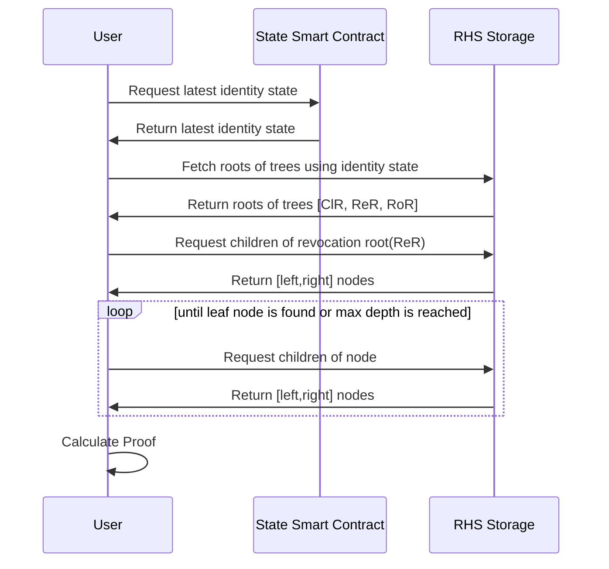

# Reverse Hash Service

## Overview

The Reverse Hash Service (RHS) is a service that allows users to construct proofs of existence or non-existence of elements in sparse merkle trees without revealing the specific element being proved. This service aims to enhance privacy of credential revocation status checks for identities.

### Introduction

[Identities](https://docs.iden3.io/protocol/spec/#identity) consist of both private and public data. Public data should be accessible to everyone, while private data should only be available to the identity owner.


> Identity State Diagram for Direct Identity

The public data of identity includes:

- The identity state, which is stored on the blockchain.
- Roots of the identity trees: Claims tree(ClT), Revocation tree(ReT), and Roots tree(RoT).
- All the nodes of the Revocation tree and Roots tree are public.

The Reverse Hash Service stores nodes of SMTs (In our case, the CIT / ReT / RoT and identity state). This service enables users to perform reverse hash lookups and construct proofs of `existence` or `non-existence` of elements without revealing the specific element being proved. The main objective of this service is to enhance the privacy and security of iden3 identities while ensuring data integrity.

### Non-revocation proof

To build non-revocation proof, we must prove that revocation nonce is not in the revocation tree.

1. The first thing we need is to get the `latest state` of the identity from the State smart contract.
2. Then we can find `roots` of the trees (Clams tree root, Revocation tree root and Roots Tree root) from RHS.
3. Once we have the `roots`, we can do a reverse hash lookup to construct merkle tree proof for revocation nonce in Revocation Tree as follows:
   - Start at the root of the tree. Iterate through each level of the tree until reaching a leaf node or exceeding the maximum tree depth.
   - For each level, fetch the corresponding node using the RHS API.
   - Based on the type of node encountered (leaf or middle node), perform different actions:
      - If the node is a leaf node and its key matches the input key, the proof of existence is complete. Set the `exists` variable to `true`, and return the constructed proof.
      - If the node is a leaf node but its key does not match the input key, the `proof of non-existence` is complete. Set the `nodeAux` variable with the leaf node’s `key` and `value`, and return the constructed proof.
      - If the node is a middle node, determine how to traverse the tree by checking the input key’s corresponding bit at the current depth. Update the next key to traverse and add the sibling node to the siblings list for proof construction.
      - If the algorithm reaches the maximum tree depth without finding a leaf node or a matching key, return an error indicating the tree depth is too high.



By following these steps, the algorithm generates a Merkle proof of existence or non-existence for a given key in a Sparse Merkle Tree without revealing the specific element being proved.

### RHS Storage

RHS Storage is a persistence layer that stores hashes of preimages. A preimage is an array of integers, which length can be theoretically any number starting from 1. In practice, only support arrays of length 2 and 3 is guaranteed as it is used in the Iden3 protocol.

The storage implements key-value approach, where key is a hash of preimage and value is a preimage itself. It is only possible to set a value for a key, but not the key itself as the key is calculated by RHS Storage as a hash of preimage using Poseidon hash function in the transaction that sets the value.

RHS Storage can be **on-chain** or **off-chain** type.

In the case of **on-chain** storage, the key-value storage is a smart contract with an interface as follows:
```solidity
interface IRHSStorage {
   /**
    * @dev Saves nodes array. Note that each node contains an array itself.
     * @param nodes An array of nodes
     */
   function saveNodes(uint256[][] memory nodes) external;

   /**
    * @dev Returns a node by its key. Note that a node contains an array.
     * @param key The key of the node
     * @return The node
     */
   function getNode(uint256 key) external view returns (uint256[] memory);
}
```
In the case of **off-chain** storage, the key-value storage is may be implemented as a service on top of a database. It can be found in the [reverse-hash-service](https://github.com/iden3/reverse-hash-service) repository.

The service exposes two endpoints:
```http
/POST {{server}}/node
Content-Type: application/json

{
   "hash":"2c32381aebce52c0c5c5a1fb92e726f66d977b58a1c8a0c14bb31ef968187325",
   "children":[
      "658c7a65594ebb0815e1cc20f54284ccdb51bb1625f103c116ce58444145381e",
      "e809a4ed2cf98922910e456f1e56862bb958777f5ff0ea6799360113257f220f"
   ]
}


/GET {{server}}/node/{{hash}}
```

### RHS Client interface and Reverse Hash Lookup

The RHS Client interface abstracts away the specific RHS Storage implementation. You are free to choose whether to connect your clients directly to RHS Storage or use RHS Client interface.

The interface defines three methods:
- **SaveNodes**: saves nodes of the tree to RHS
- **GetNode**: gets node of the tree from RHS, so it does a reverse hash lookup and reveals the preimage of the hash
- **GenerateProof**: generates proof of existence or non-existence of the element in the Sparse Merkle Tree according to the [algorithm](#smt-proof-generation) described below

The library that implements the RHS Client interface is located in the [merkletree-proof](https://github.com/iden3/merkletree-proof) repository and the interface itself is as follows:

```go
type ReverseHashCli interface {
    GenerateProof(ctx context.Context,
        treeRoot *merkletree.Hash,
        key *merkletree.Hash) (*merkletree.Proof, error)
    GetNode(ctx context.Context,
        hash *merkletree.Hash) (Node, error)
    SaveNodes(ctx context.Context,
        nodes []Node) error
}
```

The Node struct is defined as follows:
```go
type Node struct {
    Hash     *merkletree.Hash    // merkletree.Hash is an array of 32 bytes
    Children []*merkletree.Hash
}
```
Note, that the Hash field of the Node struct is a hash of the Children field, however it is not saved to RHS in the SaveNodes() method as it is calculated by RHS Storage itself. 

### Publishing identity state to RHS

If identity holder wants to publish his identity state to RHS he needs to do the following:

1. Save the state of identity to RHS `{ Hash: state, Children: [ClaimsTreeRoot, RevocationTreeRoot, RootsTreeRoot] }`
2. Save the nodes of Revocation tree and Roots tree to RHS for the intermediate nodes `{ Hash: hash, Children: [left, right] }` where left and right are the hashes of the children of the node. And for the leaf nodes `{ Hash: hash, Children: [1, key, value] }`

### Example with **off-chain RHS storage**:

```go

package main

import (
	"context"
	"encoding/json"
	"fmt"
	"math/big"

	"github.com/iden3/go-merkletree-sql/v2"
	proof "github.com/iden3/merkletree-proof/http"
)

func main() {
	ctx := context.Background()
	rhsURL := "https://rhs-staging.polygonid.me"
	state := "e12084d0d72c492c703a2053b371026bceda40afb9089c325652dfd2e5e11223"
	revocationNonce, _ := merkletree.NewHashFromBigInt(big.NewInt(670966937))

	cli := &proof.ReverseHashCli{URL: rhsURL}

	// get identity state roots (ClT root, ReT root, RoT root)
	node := getIdentityStateRoots(cli, ctx, state)
	json, err := json.Marshal(node)
	if err != nil {
		panic(err)
	}
	fmt.Println(string(json))

	// get non-revocation proof by ReT root and revocation nonce
	proof, err := cli.GenerateProof(ctx, node.Children[1], revocationNonce)
	if err != nil {
		panic(err)
	}
	jsonProof, err := proof.MarshalJSON()
	if err != nil {
		panic(err)
	}

	fmt.Println(string(jsonProof))
}

func getIdentityStateRoots(cli *proof.HTTPReverseHashCli, ctx context.Context, state string) proof.Node {
	s, err := merkletree.NewHashFromHex(state)
	if err != nil {
		panic(err)
	}

	stateValues, err := cli.GetNode(ctx, s)
	if err != nil {
		panic(err)
	}

	return stateValues
}
```

_!!! Note that on-chain RHS storage initialization is a bit more complex. Check merkletree-proof library for more details._

### RHS Storage Implementation

Off-chain: [https://github.com/iden3/reverse-hash-service](https://github.com/iden3/reverse-hash-service)

On-chain: [https://github.com/iden3/contracts/blob/master/contracts/identitytreestore/IdentityTreeStore.sol](https://github.com/iden3/contracts/blob/master/contracts/identitytreestore/IdentityTreeStore.sol)

_!!! Note that IdentityTreeStore implements SMT Proof generation algorithm on-chain as part of getRevocationStatusByIdAndState() method, so you are free to use it as alternative way to generate revocation proofs._ 

### Library to interact with RHS Storage

[https://github.com/iden3/merkletree-proof](https://github.com/iden3/merkletree-proof)

### Links

[https://docs.iden3.io/publications/pdfs/Merkle-Tree.pdf](https://docs.iden3.io/publications/pdfs/Merkle-Tree.pdf)

[https://github.com/iden3/go-merkletree-sql](https://github.com/iden3/go-merkletree-sql)

[https://github.com/0xPolygonID/js-sdk](https://github.com/0xPolygonID/js-sdk)
