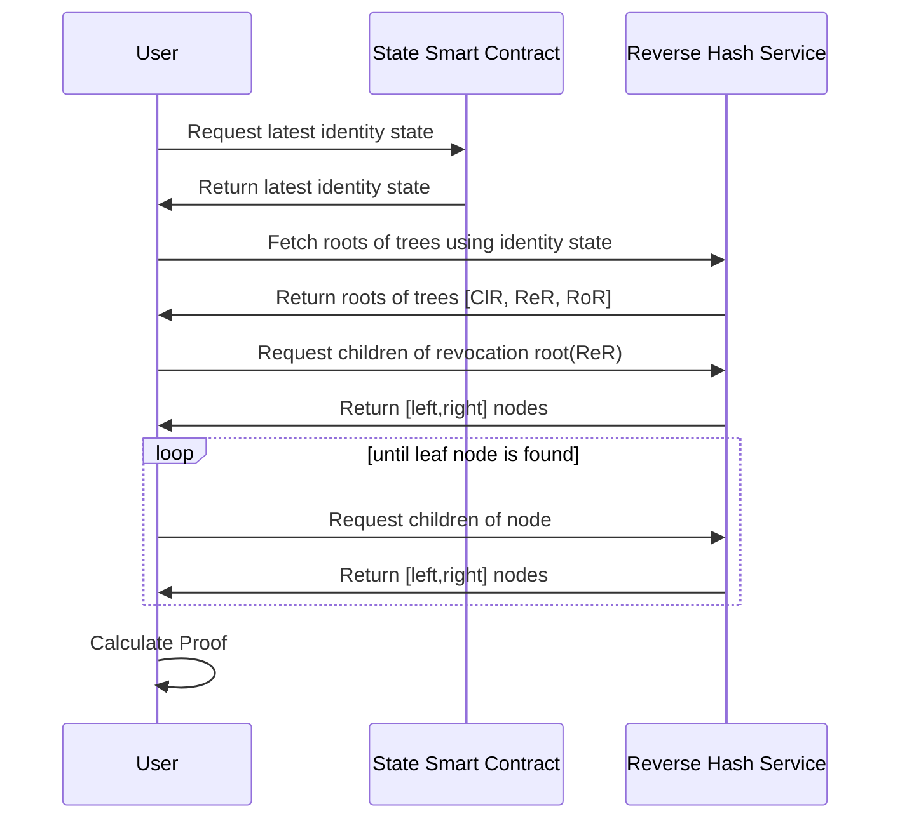

# Reverse Hash Service

## Overview

The Reverse Hash Service (RHS) is a service that allows users to construct proofs of existence or non-existence of elements in sparce merkle trees without revealing the specific element being proved. This service aims to enhance privacy of credential revocation status checks for identities.

### Introduction

[Identities](https://docs.iden3.io/protocol/spec/#identity) consist of both private and public data. Public data should be accessible to everyone, while private data should only be available to the identity owner.


> Identity State Diagram for Direct Identity

The public data of identity includes:

- The identity state, which is stored on the blockchain.
- Roots of the identity trees: Claims tree(ClT), Revocation tree(ReT), and Roots tree(RoT).
- All the nodes of the Revocation tree and Roots tree are public.

The Reverse Hash Service stores nodes of SMTs (In our case, the CIT / ReT / RoT and identity state. This service enables users to perform reverse hash lookups and construct proofs of `existence` or `non-existence` of elements without revealing the specific element being proved. The main objective of this service is to enhance the privacy and security of iden3 identities while ensuring data integrity.

### Non-revocation proof

To build non-revocation proof, we must prove that revocation nonce is not in the revocation tree.

1. The first thing we need is to get the `latest state` of the identity from the State smart contract.
2. Then we can find `roots` of the trees (Clams tree root, Revocation tree root and Roots Tree root) from RHS.
3. After this, we can do a reverse hash lookup to construct merkle tree proof for revocation nonce in revocation tree.



### Publishing identity state to RHS

If identity holder wants to publish his identity state to RHS he needs to do the following:

1. Publish the state of identity to RHS [state] = [ClaimsTreeRoot, RevocationTreeRoot, RootsTreeRoot]
2. Publish the nodes of Revocation tree and Roots tree to RHS for the intermediate nodes [hash]=[left, right] where left and right are the hashes of the children of the node. And for the leaf nodes [hash]=[1, key, value]

### Reverse hash lookup

Reverse hash lookup is a way to reveal a preimage (original message) of a specific hash value by storing hash value and original message used to generate it in the database. As Iden3 protocol uses Poseidon hash function, hash value is represented by a BigInt (~254 bit) and preimage is one or many (up to 16) BigInts.

### SMT Proof generation

Algorithm of a SMT proof generation for a given key in the tree using reverse hash lookup works as follows:

1. Start at the root of the tree. Iterate through each level of the tree until reaching a leaf node or exceeding the maximum tree depth.
2. For each level, fetch the corresponding node using the RHS API.
3. Based on the type of node encountered (leaf or middle node), perform different actions:
    - If the node is a leaf node and its key matches the input key, the proof of existence is complete. Set the `exists` variable to `true`, and return the constructed proof.
    - If the node is a leaf node but its key does not match the input key, the `proof of non-existence` is complete. Set the `nodeAux` variable with the leaf node’s `key` and `value`, and return the constructed proof.
    - If the node is a middle node, determine how to traverse the tree by checking the input key’s corresponding bit at the current depth. Update the next key to traverse and add the sibling node to the siblings list for proof construction.
    - If the algorithm reaches the maximum tree depth without finding a leaf node or a matching key, return an error indicating the tree depth is too high.

By following these steps, the algorithm generates a Merkle proof of existence or non-existence for a given key in a Sparse Merkle Tree without revealing the specific element being proved.

Example:

```go

package main

import (
	"context"
	"encoding/json"
	"fmt"
	"math/big"

	"github.com/iden3/go-merkletree-sql/v2"
	proof "github.com/iden3/merkletree-proof"
)

func main() {
	ctx := context.Background()
	rhsURL := "https://rhs-staging.polygonid.me"
	state := "e12084d0d72c492c703a2053b371026bceda40afb9089c325652dfd2e5e11223"
	revocationNonce, _ := merkletree.NewHashFromBigInt(big.NewInt(670966937))

	cli := &proof.HTTPReverseHashCli{URL: rhsURL}

	// get identity state roots (ClT root, ReT root, RoT root)
	node := getIdentityStateRoots(cli, ctx, state)
	json, err := json.Marshal(node)
	if err != nil {
		panic(err)
	}
	fmt.Println(string(json))

	// get non-revocation proof by ReT root and revocation nonce
	proof, err := cli.GenerateProof(ctx, node.Children[1], revocationNonce)
	if err != nil {
		panic(err)
	}
	jsonProof, err := proof.MarshalJSON()
	if err != nil {
		panic(err)
	}

	fmt.Println(string(jsonProof))
}

func getIdentityStateRoots(cli *proof.HTTPReverseHashCli, ctx context.Context, state string) proof.Node {
	s, err := merkletree.NewHashFromHex(state)
	if err != nil {
		panic(err)
	}

	stateValues, err := cli.GetNode(ctx, s)
	if err != nil {
		panic(err)
	}

	return stateValues
}
```

### Credential Status

If identity is published to RHS then we can check the credential status by doing a reverse hash lookup for the credential revocation nonce. In this case credential issued by this identity may have credential status type `Iden3ReverseSparseMerkleTreeProof`

```json
...{    
"type": "Iden3ReverseSparseMerkleTreeProof"    
"id": "https://rhs-staging.polygonid.me/node",    
"revocationNonce": 3409889195,
}...
```

***id*** - address of RHS node

***revocationNonce*** - credential revocation nonce

***type*** - type of the credential status

JSON-LD context: https://schema.iden3.io/core/jsonld/iden3proofs.jsonld

Type implementations:

- Go: [https://github.com/iden3/go-schema-processor](https://github.com/iden3/go-schema-processor)
- JS: [https://github.com/0xPolygonID/js-sdk](https://github.com/0xPolygonID/js-sdk)

### RHS Implementation

[https://github.com/iden3/reverse-hash-service](https://github.com/iden3/reverse-hash-service)

### Library to interact with RHS

[https://github.com/iden3/merkletree-proof](https://github.com/iden3/merkletree-proof)

### Links

[https://docs.iden3.io/publications/pdfs/Merkle-Tree.pdf](https://docs.iden3.io/publications/pdfs/Merkle-Tree.pdf)

[https://github.com/iden3/go-merkletree-sql](https://github.com/iden3/go-merkletree-sql)

[https://github.com/0xPolygonID/js-sdk](https://github.com/0xPolygonID/js-sdk)